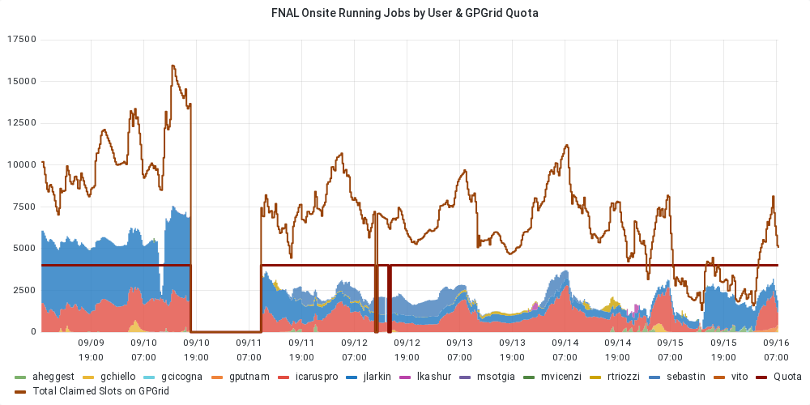
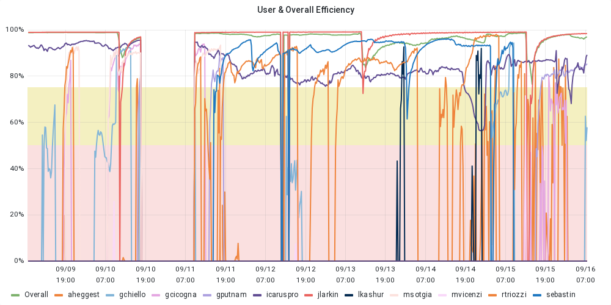
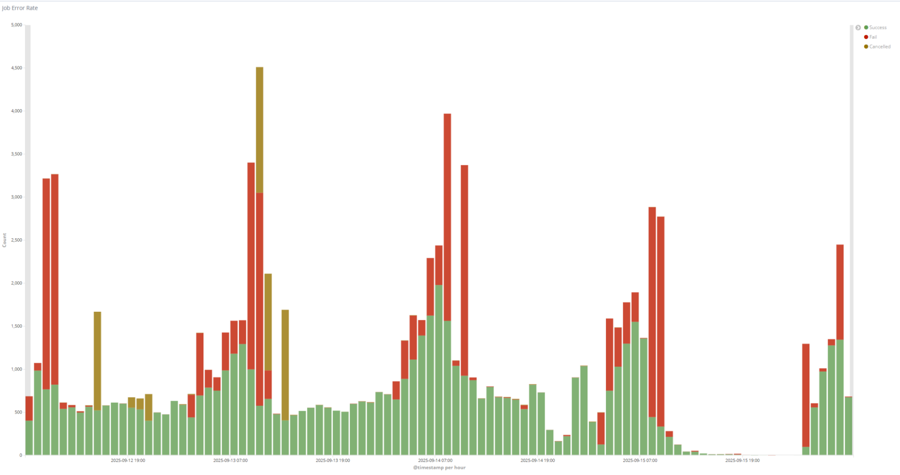
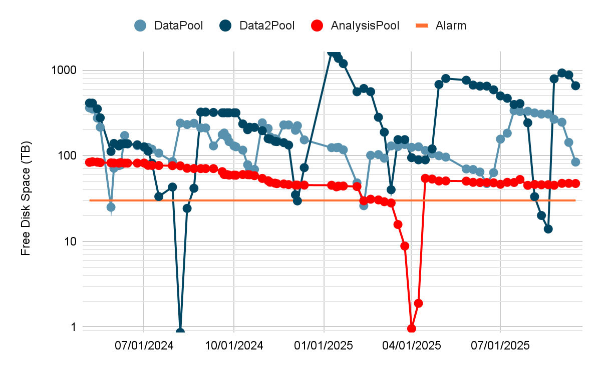
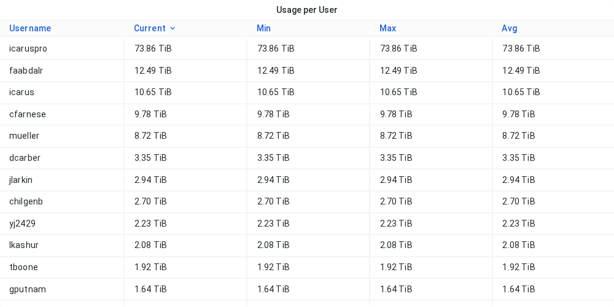
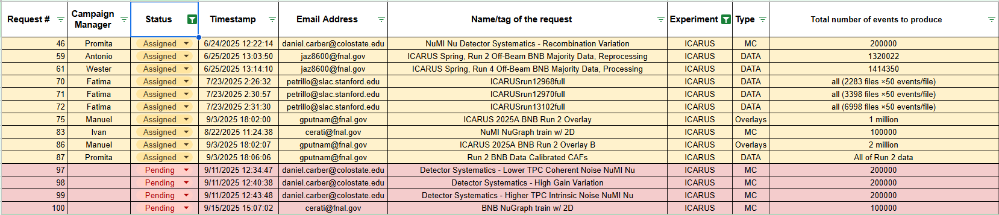

## Sep 9, 2025 9:00 AM CDT | ICARUS Production Meeting

### Attendees

Manuel, Giuseppe, Vito, Tracy, Antonio, Valerio, Ivan, Matteo

### Monitoring resource usage

| User Grid Usage History of the *Running Jobs by User* for the last 7 days: [link](https://fifemon.fnal.gov/monitor/d/000000053/experiment-batch-details?orgId=1&viewPanel=9&from=now-7d&to=now&var-experiment=icarus&var-pool=dune-global&var-pool=fifebatch) | User Job Efficiency History of the User Job Efficiency for the last 7 days: [link](https://fifemon.fnal.gov/monitor/d/000000022/experiment-efficiency-details?from=now-7d&to=now&var-experiment=icarus&var-pool=dune-global&var-pool=fifebatch&orgId=1&viewPanel=2) |
| ----- | ----- |
|  |  |
| **Icaruspro Jobs Exit Code** History of the icaruspro job exit code for the last 7 days: [link](https://landscape.fnal.gov/kibana/app/kibana#/dashboard/ba047b90-b8ca-11e7-989a-91951b87e80a?_g=\(refreshInterval:\(pause:!t,value:0\),time:\(from:now-4d,mode:relative,to:now\)\)&_a=\(description:'View%20jobs%20exit%20code,%20where%20they%20ran,%20and%20logs',filters:!\(\('$state':\(store:appState\),meta:\(alias:!n,disabled:!f,index:'fifebatch-history-*',key:pool,negate:!f,params:\(query:fifebatch,type:phrase\),type:phrase,value:fifebatch\),query:\(match:\(pool:\(query:fifebatch,type:phrase\)\)\)\),\('$state':\(store:appState\),meta:\(alias:!n,disabled:!f,index:'fifebatch-history-*',key:User,negate:!f,params:\(query:'icaruspro@fnal.gov',type:phrase\),type:phrase,value:'icaruspro@fnal.gov'\),query:\(match:\(User:\(query:'icaruspro@fnal.gov',type:phrase\)\)\)\),\('$state':\(store:appState\),meta:\(alias:!n,disabled:!f,index:'fifebatch-history-*',key:Jobsub_Group,negate:!f,params:\(query:icarus,type:phrase\),type:phrase,value:icarus\),query:\(match:\(Jobsub_Group:\(query:icarus,type:phrase\)\)\)\)\),fullScreenMode:!f,options:\(darkTheme:!f\),panels:!\(\(embeddableConfig:\(vis:\(colors:\(Cancelled:%23967302,Fail:%23BF1B00,Success:%23629E51\),legendOpen:!t\)\),gridData:\(h:15,i:'1',w:40,x:0,y:0\),id:'2f40f420-b8ca-11e7-989a-91951b87e80a',panelIndex:'1',type:visualization,version:'6.8.23'\),\(gridData:\(h:10,i:'2',w:24,x:24,y:15\),id:'569cca30-b8ca-11e7-989a-91951b87e80a',panelIndex:'2',type:visualization,version:'6.8.23'\),\(gridData:\(h:10,i:'3',w:24,x:0,y:15\),id:'65759a00-b8ca-11e7-989a-91951b87e80a',panelIndex:'3',type:visualization,version:'6.8.23'\),\(embeddableConfig:\(columns:!\(JobsubJobId,Owner,ExitCode,ExitSignal,MATCH_GLIDEIN_Site,MachineAttrMachine0,stdout,stderr\),sort:!\('@timestamp',desc\)\),gridData:\(h:30,i:'4',w:48,x:0,y:25\),id:'7e94c3c0-b8cb-11e7-989a-91951b87e80a',panelIndex:'4',type:search,version:'6.8.23'\),\(gridData:\(h:15,i:'5',w:8,x:40,y:0\),id:AWZpvkXbLj3wKbt0N_Vp,panelIndex:'5',type:visualization,version:'6.8.23'\)\),query:\(language:lucene,query:\(match_all:\(\)\)\),timeRestore:!f,title:'Fifebatch%20History',viewMode:view\)) | **SBN Data Pools** [link](https://fifemon.fnal.gov/monitor/d/rflbgV-iz/dcache-by-poolgroup?orgId=1&var-PoolGroup=SbnData2Pools&from=now-3h&to=now&refresh=5m) |
|  |  |
| Dcache Persistent Usage per user Total is 114 TB: [link](https://fifemon.fnal.gov/monitor/d/000000175/dcache-persistent-usage-by-vo?orgId=1&var-VO=icarus) |  |
|  |  |

### Production requests

| 2025 Not-Completed Production Requests |
| ----- |
|  |

Link to [spreadsheet](https://docs.google.com/spreadsheets/d/1ffBp475tEzlRilFs7xLhbevSZHjsuk1Dm5FGFIPWsFM/edit?gid=1567393491#gid=1567393491)  
Link to [github project](https://github.com/orgs/SBNSoftware/projects/49)

### Active Campaigns in POMS

| Campaign Name | ID | Creator | Note |
| :---- | :---- | :---- | :---- |
| ICARUS\_2025\_data\_run\_12968 \_PMTwaveforms | 10244 | faabdalr | \#70 |
| 2025A\_ICARUS\_Overlays\_BNB\_RUN2 | 10165 | manueld | \#75 |
| 2025\_ICARUS\_BNB\_Run2\_v10\_SBN | 10070 | manueld | \#46 |
| 2025A\_ICARUS\_NuGraph2 | 9975 | icaro | \#83 |
| ICARUS\_keepup | 9442 | icaro | keepup |

Link [here](https://pomsgpvm02.fnal.gov/poms/show_campaigns/icarus/production)

### Notes

## **Quick recap**

The team discussed investigating workflow discrepancies and data collection issues, including concerns about disk usage and monitoring problems caused by a firewall. Updates were provided on the status of various running campaigns, with several campaigns facing processing bottlenecks due to resource constraints and worker node limitations. The group addressed resource management challenges, including quota discussions for ICARUS slots and production accounts, while also touching on ongoing issues like Rucio synchronization and potential data pool merging.

## **Next steps**

* Manuel to double-check campaign 46 status and update the database  
* Antonio to complete checking the coherence between output and input files for campaign 59 and fill the database when completed  
* Vito to explore with local experts the possibility of implementing a mechanism to give ICARUS Pro better priority compared to regular users  
* Giuseppe to discuss with Adam about maintaining the increased grid slots quota beyond October  
* Valerio to check why approximately 10 runs are giving errors about failed attempts to get MD5 codes  
* Matteo to redo processing at Fermilab with the same configuration and files to verify reproducibility of results

  ## **Summary**

  ### **Workflow Discrepancy and Data Issues**

  Matteo discussed investigating discrepancies in results when running the same workflow twice, with Giuseppe suggesting a check to determine if the code has non-deterministic behavior. Vito explained that a recent monitoring issue caused by a firewall was likely responsible for gaps in the data collection. The team also discussed concerns about disk usage in the data pool, which Vito noted was very low at around 4%, though tens of terabytes were still being used.

  ### **Campaign Status and Processing Updates**

  The team discussed the status of various running campaigns, with Manuel confirming he would double-check campaign 46 which he thought was completed. Antonio reported that campaign 59 was completed and being verified for coherence between output and input files. Ivan provided updates on campaigns 83, 85, and 86, noting that the DeadSim stage was a bottleneck due to insufficient worker nodes and memory requirements, particularly affecting campaign 75 which had processed only a thousand out of 50,000 files. The team agreed to wait for Vito's input on potential solutions to speed up the processing.

  ### **Icaruspro Priority and Slot Management**

  Vito explained that Icaruspro runs with the same baseline priority as regular users but faces challenges in securing new slots due to its high job volume and priority increase mechanisms. Giuseppe asked if there was a way to maintain separate quotas for ICARUS slots while allowing opportunistic access, and if different priority rules could be set for production accounts. Vito confirmed that production accounts follow the same security rules as regular users and there is currently no mechanism to improve their priority, though he will explore further discussions with local experts about potential solutions. The group also discussed the need to survey other users' resource usage to avoid duplication of production-like jobs.

  ### **Grid Quota and System Updates**

  The team discussed several ongoing issues and updates. Vito reported requesting a temporary quota increase for grid slots that will last until the end of October, and suggested exploring the possibility of making this quota permanent. Valerio confirmed that the Rucio synchronization issue has been resolved, with only about 10 out of 62 runs still showing errors related to file MD5 checksums. Giuseppe and Steven discussed the idea of merging data pools, but decided not to pursue it immediately unless there are changes to the disk system. The conversation ended with Matteo planning to redo processing at Fermilab to validate results across different computing sites.

### Requests

* Assigned:  
  * Request \#46 \[Promita\]:   
    * Check duplicate files on going.   
    * Info on db?  
  * Request \#59 \[Antonio\]: \[RUN2 offbeam BNB Majority\]  
    * Started.the stage1 of request \#59 is failing. Under investigation. More or less finished. Few percent is remaining. Campaign Stage POT\_stage1\_caf\_larcv\_stage1onDiskOFF for request \#59 is almost done. checkjob shows 1 file in hold state. Completed  
  * Request \#61 \[Thomas\]: \[RUN4\]   
    * Report from Thomas: [here](https://sbn-docdb.fnal.gov/cgi-bin/sso/ShowDocument?docid=43288)  
  * Request \#70 \[Fatima\]:   
    * Similar to \#71, \#72.  
    * The campaigns are running stage0.  
  * Request \#75 \[Manuel\]:  
    * Here was a bug in the configuration file affecting metadata (file lineage/parentage) for Request 75, not the content of the files themselves, making the produced files still usable. Due to the tedious nature of checking each file, a resubmission of the sample was deemed necessary.   
    * Do we have enough data for a 2-million-event request? Yes.   
    * It is still running, but no additional jobs will be submitted. It will be considered done once the database is filled with information  
  * Request \#83 \[Ivan\]:   
    * Slowly moving, with only about 1/3 finished, due to high memory requirements (17 GB RAM) for the detsim stage.  
    * Detsim is identified as the main bottleneck for Monte Carlo campaigns.  
    * It was suggested to compare performance with Gray's setup, who claimed to run thousands of concurrent jobs with similar memory.  
    * A suggestion was made to run the detsim stage standalone to allow it to utilize large slots more efficiently, while other less memory-intensive stages could run separately.  
  * Request \#86 \[Manuel/Ivan\]:   
    * This request is a continuation of a previous one, increasing from 1 million to 2 million events, making a total of 3 million for one request.   
    * It's essentially a copy, with processed files from Request \#75 to be skipped.   
    * For Request 86, Gray requested breaking up the workflow into three stages to better handle resources, particularly the memory-intensive detsim stage (around 17 GB RAM). This also involves correcting the file lineage bug. Ivan is changing the workflow and will hand it over to Manuel.  
  * Request \#87 \[Promita/Alessandro\]:   
    * This is similar to Request 86, involving rerunning from stage one with calibration added, which was previously absent. This will be handled by a different team member. The stage one issue was investigated and solved by using a different FCL file.

### Action Items and Open issue

* Link to [action items](https://github.com/orgs/SBNSoftware/projects/32)  
  * Assigned:  
    * \[Matteo\] Investigate missing compressed files on disk: 		issue [\#65](https://github.com/SBNSoftware/icarus-production/issues/65)  
      6 compressed files are declared to samweb with location, but no files are physically in the declared location.  
    * \[Matteo\] Proposal for deletion: 					issue [\#51](https://github.com/SBNSoftware/icarus-production/issues/51)  
      * Problem with CTA not accepting small size files (\<100 MB)  
      * \[To-Do\] The only request for these files is to keep purity monitor files. Need to be tar and then moved to tape. How to do that?  
        * One dataset 500 GB, files all in the same folder.   
        * One dataset is 9 GB, maybe just one tarball, 1k files too many to put them as parent, maybe extra file with all files  
        * Tar in bunch of subgroups of folders  
      * \[In-Progess\] The other datasets can be deleted (confirmed from calib and trigger groups). They will be removed with *sam\_retire\_dataset*  
    * \[Matteo\] review of cfg file by Ivan					issue [\#90](https://github.com/SBNSoftware/icarus-production/issues/90)  
      Test campaign on going. See [here](https://pomsgpvm02.fnal.gov/poms/show_campaign_stages/icarus/production?campaign_name=2025A_ICARUS_NuMI_MC_FHC_mt_test&view_active=view_active&view_mine=2442&view_others=2442&view_production=view_production&update_view=update_view)  
    * \[Vito\] Rucio issue. Trying in interactive mode, things are on going. Solved in July  
  * Pending  
    *   
* Link to [open issues](https://github.com/SBNSoftware/icarus-production/issues?q=is%3Aopen+is%3Aissue+-project%3Asbnsoftware%2F31+-project%3Asbnsoftware%2F32+)

### CNAF

* 

### FNAL

* 

### Keepup

* \[Ivan\]: Everything is running

### Infrastructure

* \[Giuseppe\]:  
  * Idea of merging two datapools (suggested by DCache team). So disk is larger and then assign quota to experiments. Still few details to be discussed. Not Urgent

### Software

* \[Tracy\]: 

### Computing

* \[Vito\]:  
  * dCache Maintenance: Scheduled for September 17th (next week), lasting about half an hour (8-8:30 AM), with a few minutes of downtime to restart the master pool. This update aims to fix issues with pools crashing when full.  
  * GPVM Kernel Updates: GPVMs will now have automatic reboots for kernel updates on the third Wednesday of each month when not in use, making the process easier for admins.

