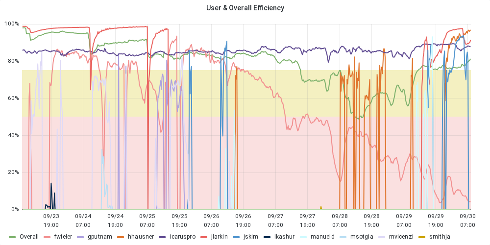

## Sep 30, 2025 9:00 AM CDT | ICARUS Production Meeting

### Attendees

Manuel, Promita, Giuseppe, Vito, Alessandro, Fatima, Valerio, Matteo \+ F. Poppi

### Monitoring resource usage

| User Grid Usage History of the *Running Jobs by User* for the last 7 days: [link](https://fifemon.fnal.gov/monitor/d/000000053/experiment-batch-details?orgId=1&viewPanel=9&from=now-7d&to=now&var-experiment=icarus&var-pool=dune-global&var-pool=fifebatch) | User Job Efficiency History of the User Job Efficiency for the last 7 days: [link](https://fifemon.fnal.gov/monitor/d/000000022/experiment-efficiency-details?from=now-7d&to=now&var-experiment=icarus&var-pool=dune-global&var-pool=fifebatch&orgId=1&viewPanel=2) |
| ----- | ----- |
|  |  |
| **Icaruspro Jobs Exit Code** History of the icaruspro job exit code for the last 7 days: [link](https://landscape.fnal.gov/kibana/app/kibana#/dashboard/ba047b90-b8ca-11e7-989a-91951b87e80a?_g=\(refreshInterval:\(pause:!t,value:0\),time:\(from:now-4d,mode:relative,to:now\)\)&_a=\(description:'View%20jobs%20exit%20code,%20where%20they%20ran,%20and%20logs',filters:!\(\('$state':\(store:appState\),meta:\(alias:!n,disabled:!f,index:'fifebatch-history-*',key:pool,negate:!f,params:\(query:fifebatch,type:phrase\),type:phrase,value:fifebatch\),query:\(match:\(pool:\(query:fifebatch,type:phrase\)\)\)\),\('$state':\(store:appState\),meta:\(alias:!n,disabled:!f,index:'fifebatch-history-*',key:User,negate:!f,params:\(query:'icaruspro@fnal.gov',type:phrase\),type:phrase,value:'icaruspro@fnal.gov'\),query:\(match:\(User:\(query:'icaruspro@fnal.gov',type:phrase\)\)\)\),\('$state':\(store:appState\),meta:\(alias:!n,disabled:!f,index:'fifebatch-history-*',key:Jobsub_Group,negate:!f,params:\(query:icarus,type:phrase\),type:phrase,value:icarus\),query:\(match:\(Jobsub_Group:\(query:icarus,type:phrase\)\)\)\)\),fullScreenMode:!f,options:\(darkTheme:!f\),panels:!\(\(embeddableConfig:\(vis:\(colors:\(Cancelled:%23967302,Fail:%23BF1B00,Success:%23629E51\),legendOpen:!t\)\),gridData:\(h:15,i:'1',w:40,x:0,y:0\),id:'2f40f420-b8ca-11e7-989a-91951b87e80a',panelIndex:'1',type:visualization,version:'6.8.23'\),\(gridData:\(h:10,i:'2',w:24,x:24,y:15\),id:'569cca30-b8ca-11e7-989a-91951b87e80a',panelIndex:'2',type:visualization,version:'6.8.23'\),\(gridData:\(h:10,i:'3',w:24,x:0,y:15\),id:'65759a00-b8ca-11e7-989a-91951b87e80a',panelIndex:'3',type:visualization,version:'6.8.23'\),\(embeddableConfig:\(columns:!\(JobsubJobId,Owner,ExitCode,ExitSignal,MATCH_GLIDEIN_Site,MachineAttrMachine0,stdout,stderr\),sort:!\('@timestamp',desc\)\),gridData:\(h:30,i:'4',w:48,x:0,y:25\),id:'7e94c3c0-b8cb-11e7-989a-91951b87e80a',panelIndex:'4',type:search,version:'6.8.23'\),\(gridData:\(h:15,i:'5',w:8,x:40,y:0\),id:AWZpvkXbLj3wKbt0N_Vp,panelIndex:'5',type:visualization,version:'6.8.23'\)\),query:\(language:lucene,query:\(match_all:\(\)\)\),timeRestore:!f,title:'Fifebatch%20History',viewMode:view\)) | **SBN Data Pools** [link](https://fifemon.fnal.gov/monitor/d/rflbgV-iz/dcache-by-poolgroup?orgId=1&var-PoolGroup=SbnData2Pools&from=now-3h&to=now&refresh=5m) |
|  |  |
| Dcache Persistent Usage per user Total is 114 TB: [link](https://fifemon.fnal.gov/monitor/d/000000175/dcache-persistent-usage-by-vo?orgId=1&var-VO=icarus) |  |
|  |  |

### Production requests

| 2025 Not-Completed Production Requests |
| ----- |
|  |

Link to [spreadsheet](https://docs.google.com/spreadsheets/d/1ffBp475tEzlRilFs7xLhbevSZHjsuk1Dm5FGFIPWsFM/edit?gid=1567393491#gid=1567393491)  
Link to [github project](https://github.com/orgs/SBNSoftware/projects/49)

### Active Campaigns in POMS

| Campaign Name | ID | Creator | Note |
| :---- | :---- | :---- | :---- |
| 2025A\_NuMI\_nuCos\_CV\_detsys | 10042 | promitar | NuMI variations |
| 2025A\_ICARUS\_NuGraph2 | 9975 | icaro | \#83 |
| ICARUS\_keepup | 9442 | icaro | keepup |

Link [here](https://pomsgpvm02.fnal.gov/poms/show_campaigns/icarus/production)

### Notes

* **Disk Space Usage:**   
  * Giuseppe initiated a disk usage (`du`) scan to identify deletable data, with results expected within a day.  
      
    Tracy: Theoretically we were keeping the histogram files (and once Christian has used them they can be deleted?)( and calibration files... but not stage0/stage1  
  * Actions:   
    * **Polaris Folder (Stage 1\)**: An estimated **82 TB** of data from Stage 1 processing has been confirmed by Thomas as unnecessary and can be cleared. Giuseppe specified a precise deletion methodology: the team will remove the file location but preserve the file metadata on SamWeb. This approach ensures that the data can still be navigated via its metadata, even after the physical files are deleted.  
      Start from stage1 from Polaris (something like 82 TB).  
    * **Keepup**: to discuss  
    * **MC Productions**: Promita Roy presented her analysis of obsolete MC samples, identifying two distinct categories for cleanup:  
      * Immediate Deletion: Approximately **110-120 TB** of obsolete samples can be deleted immediately. These include early detector systematics simulations that were generated when the system was unstable and are now superseded by correct, final samples.  
      * Deletion After Confirmation: Other older samples, produced with previous versions of the Icarus code, have also been identified. Before these are removed, Promita will compile a list and send a confirmation email to the collaboration to ensure no one is actively using them.  
* **Memory issue on overlay production**:.  
  * **Alessandro's Campaign**: This campaign was found to be incorrectly using the "pro" subgroup. Vito will manually update the accounting group for this campaign to correct the resource allocation, noting that this will require several iterations as new jobs from the submission enter the queue.  
    * **Ivan's Campaign (NuGraph)**: The status of this campaign is uncertain. While it is memory-intensive and thus a candidate for the subgroup, its overall strategy is unclear. While the team estimated the campaign was over 60% complete, a new resubmission from yesterday (V3) appears to restart from stage zero, creating confusion about the overall strategy and progress. Consultation with Ivan is required to resolve this ambiguity. This lack of clarity is a direct blocker for Manuel's pending requests (75 & 86).  
    * **Opportunistic Resources for Other Campaigns:** Correspondingly, all other, non-overlay campaigns will be moved off the `pro subgroup` to primarily use opportunistic slots, which are still a "sizable amount" and sufficient for those lower-memory jobs.  
    * **Parallel Optimizations:** In parallel, efforts are underway to improve memory usage. One potential solution is splitting photon simulation from TPC simulation, which could reduce memory requirements from 16GB to 12GB and significantly ease resource contention.  
* **Extra Computing Resources**:   
  Change the total number of slots available to the experiment  
  Requested for: Giuseppe Cerati  
  Group: icarus  
  Requested job slots: 6000 (Current: 4000\)  
  Valid until: 2027-01-31

### Requests

* Assigned:  
  * Request \#59 \[Antonio\]: \[RUN2 offbeam BNB Majority\]  
    * Started.the stage1 of request \#59 is failing. Under investigation. More or less finished. Few percent is remaining. Campaign Stage POT\_stage1\_caf\_larcv\_stage1onDiskOFF for request \#59 is almost done. checkjob shows 1 file in hold state. Completed. Antonio to fill the db  
  * Request \#61 \[Thomas\]: \[RUN4\]   
    * Completed  
  * Request \#71, \#72 \[Fatima\]:   
    * 72 is running. An estimated 25-30% of jobs completed successfully, but the remainder failed, likely due to timeouts. Vito to check logs. Fatima to potentially increase job lifetime and resubmit.  
    * 71 is pending  
  * Request \#75 \[Manuel\]:  
    * Here was a bug in the configuration file affecting metadata (file lineage/parentage) for Request 75, not the content of the files themselves, making the produced files still usable. Due to the tedious nature of checking each file, a resubmission of the sample was deemed necessary.   
    * Do we have enough data for a 2-million-event request? Yes.   
    * It is still running, but no additional jobs will be submitted. It will be considered done once the database is filled with information  
  * Request \#83 \[Ivan\]:   
    * Slowly moving, with only about 1/3 finished, due to high memory requirements (17 GB RAM) for the detsim stage.  
    * Detsim is identified as the main bottleneck for Monte Carlo campaigns.  
    * It was suggested to compare performance with Gray's setup, who claimed to run thousands of concurrent jobs with similar memory.  
    * A suggestion was made to run the detsim stage standalone to allow it to utilize large slots more efficiently, while other less memory-intensive stages could run separately.  
  * Request \#86 \[Manuel/Ivan\]:   
    * This request is a continuation of a previous one, increasing from 1 million to 2 million events, making a total of 3 million for one request.   
    * It's essentially a copy, with processed files from Request \#75 to be skipped.   
    * For Request 86, Gray requested breaking up the workflow into three stages to better handle resources, particularly the memory-intensive detsim stage (around 17 GB RAM). This also involves correcting the file lineage bug. Ivan is changing the workflow and will hand it over to Manuel.  
  * Request \#97, \#98, \#99 \[Alessandro\]: 	  
    * \#97 Approximately 16,000 jobs failed and require recovery.  
    * \#98 Approximately 10,000 jobs failed and require recovery.  
    * \#99 is running  
  * Request \#100 \[Ivan\]: 	  
    * On NERSC. No jobs have run yet.  
  * Request \#101 \[Antonio/Ivan\]: 	  
    *   
  * Request \#108 \[\]: 	  
    * 

### Action Items and Open issue

* Link to [action items](https://github.com/orgs/SBNSoftware/projects/32)  
  * Assigned:  
    * \[Matteo\] Investigate missing compressed files on disk: 		issue [\#65](https://github.com/SBNSoftware/icarus-production/issues/65)  
      6 compressed files are declared to samweb with location, but no files are physically in the declared location.  
    * \[Matteo\] Proposal for deletion: 					issue [\#51](https://github.com/SBNSoftware/icarus-production/issues/51)  
      * Problem with CTA not accepting small size files (\<100 MB)  
      * \[To-Do\] The only request for these files is to keep purity monitor files. Need to be tar and then moved to tape. How to do that?  
        * One dataset 500 GB, files all in the same folder.   
        * One dataset is 9 GB, maybe just one tarball, 1k files too many to put them as parent, maybe extra file with all files  
        * Tar in bunch of subgroups of folders  
      * \[In-Progess\] The other datasets can be deleted (confirmed from calib and trigger groups). They will be removed with *sam\_retire\_dataset*  
    * \[Matteo\] review of cfg file by Ivan					issue [\#90](https://github.com/SBNSoftware/icarus-production/issues/90)  
      Test campaign on going. See [here](https://pomsgpvm02.fnal.gov/poms/show_campaign_stages/icarus/production?campaign_name=2025A_ICARUS_NuMI_MC_FHC_mt_test&view_active=view_active&view_mine=2442&view_others=2442&view_production=view_production&update_view=update_view)  
    * \[Matteo\] Ask Thomas how will take care of deleting 82 TB from the Polaris folder (Stage 1\) by removing the location while preserving metadata on SamWeb  
    * \[Promita\] Begin deletion of the 110-120 TB of clearly identified obsolete MC files  
    * \[Promita\] Compile a list of other potentially obsolete MC and data samples and email the collaboration for usage confirmation before any deletion  
    * \[Vito\] Update the accounting group for Alessandro’s campaign to remove it from the "pro" subgroup  
    * \[Giuseppe\] Consult with Ivan to clarify the status, strategy, and resource requirements for the NuGraph campaign  
    * \[Antonio\] Update the database for the completed Request \#59  
    * \[Fatima/Vito\] Investigate the failure of Request \#72 by checking logs and determining the root cause  
    * \[Fatima/Promita\] Recover failed jobs for campaigns \#97 and \#98  
    * \[Antonio\] Status of Request \#101  
  * Pending  
    *   
* Link to [open issues](https://github.com/SBNSoftware/icarus-production/issues?q=is%3Aopen+is%3Aissue+-project%3Asbnsoftware%2F31+-project%3Asbnsoftware%2F32+)

### CNAF

* 

### FNAL

* 

### Keepup

* \[Ivan\]: Everything is running

### Infrastructure

* \[Giuseppe\]:  
  * Idea of merging two datapools (suggested by DCache team). So disk is larger and then assign quota to experiments. Still few details to be discussed. Not Urgent  
  * Fermilab is looking into AI to help with FIFE monitoring\!

### Software

* \[Tracy\]:   
  * 

### Computing

* \[Vito\]:  
  * **NERSC Allocation for 2026**: Vito reported on the upcoming NERSC allocation request for 2026\. The core strategic takeaway is that to secure a larger allocation, the team must demonstrate higher utilization of its current resources. Current usage is approximately 40-50%. The plan is to increase this figure with upcoming large-memory campaigns to build a stronger case for the request.
