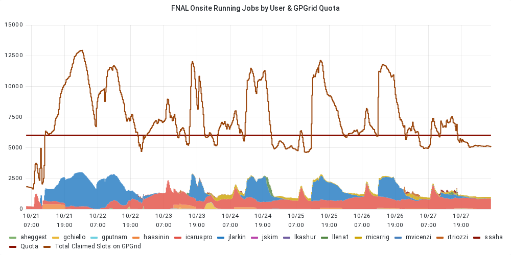
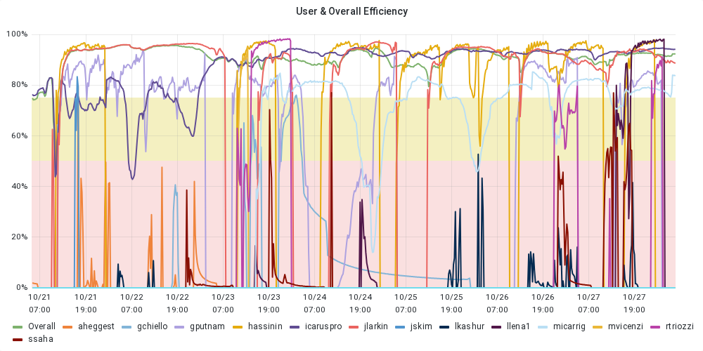
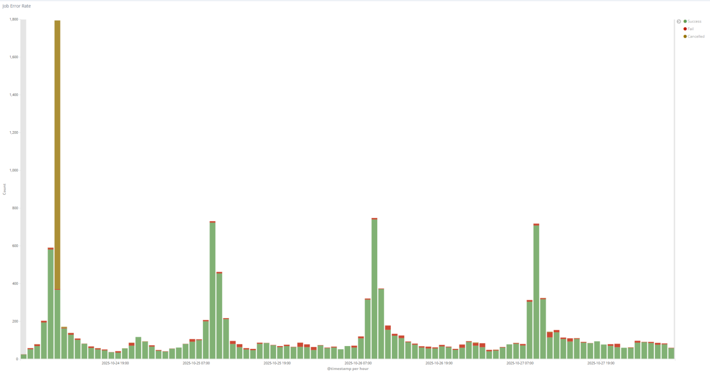
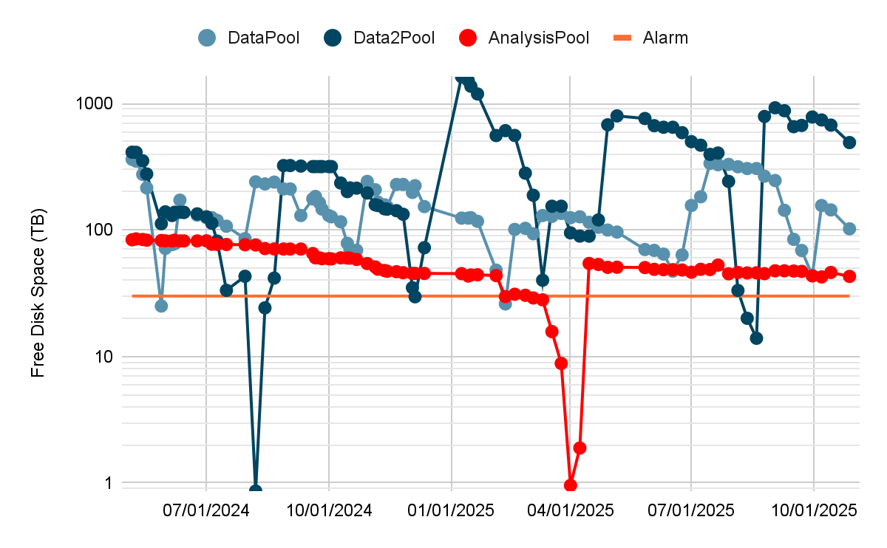
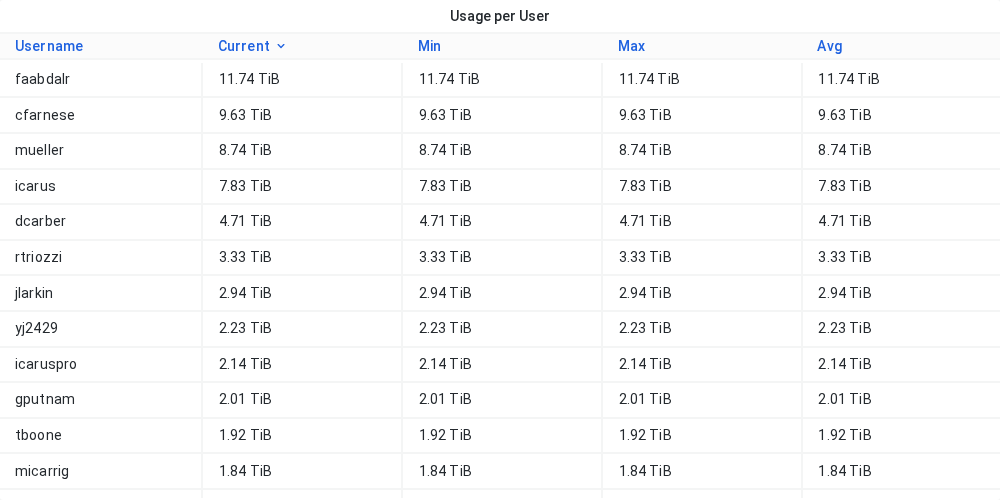
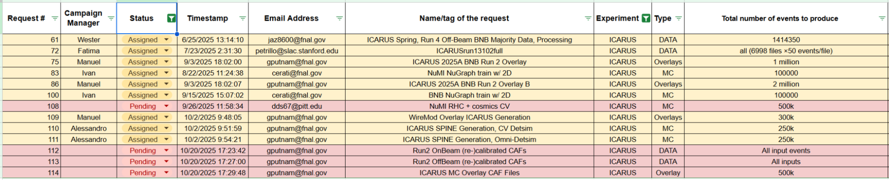

## Oct 28, 2025 9:00 AM CDT | ICARUS Production Meeting

### Attendees

### Monitoring resource usage

| User Grid Usage History of the *Running Jobs by User* for the last 7 days: [link](https://fifemon.fnal.gov/monitor/d/000000053/experiment-batch-details?orgId=1&viewPanel=9&from=now-7d&to=now&var-experiment=icarus&var-pool=dune-global&var-pool=fifebatch) | User Job Efficiency History of the User Job Efficiency for the last 7 days: [link](https://fifemon.fnal.gov/monitor/d/000000022/experiment-efficiency-details?from=now-7d&to=now&var-experiment=icarus&var-pool=dune-global&var-pool=fifebatch&orgId=1&viewPanel=2) |
| ----- | ----- |
|  |  |
| **Icaruspro Jobs Exit Code** History of the icaruspro job exit code for the last 7 days: [link](https://landscape.fnal.gov/kibana/app/kibana#/dashboard/ba047b90-b8ca-11e7-989a-91951b87e80a?_g=\(refreshInterval:\(pause:!t,value:0\),time:\(from:now-4d,mode:relative,to:now\)\)&_a=\(description:'View%20jobs%20exit%20code,%20where%20they%20ran,%20and%20logs',filters:!\(\('$state':\(store:appState\),meta:\(alias:!n,disabled:!f,index:'fifebatch-history-*',key:pool,negate:!f,params:\(query:fifebatch,type:phrase\),type:phrase,value:fifebatch\),query:\(match:\(pool:\(query:fifebatch,type:phrase\)\)\)\),\('$state':\(store:appState\),meta:\(alias:!n,disabled:!f,index:'fifebatch-history-*',key:User,negate:!f,params:\(query:'icaruspro@fnal.gov',type:phrase\),type:phrase,value:'icaruspro@fnal.gov'\),query:\(match:\(User:\(query:'icaruspro@fnal.gov',type:phrase\)\)\)\),\('$state':\(store:appState\),meta:\(alias:!n,disabled:!f,index:'fifebatch-history-*',key:Jobsub_Group,negate:!f,params:\(query:icarus,type:phrase\),type:phrase,value:icarus\),query:\(match:\(Jobsub_Group:\(query:icarus,type:phrase\)\)\)\)\),fullScreenMode:!f,options:\(darkTheme:!f\),panels:!\(\(embeddableConfig:\(vis:\(colors:\(Cancelled:%23967302,Fail:%23BF1B00,Success:%23629E51\),legendOpen:!t\)\),gridData:\(h:15,i:'1',w:40,x:0,y:0\),id:'2f40f420-b8ca-11e7-989a-91951b87e80a',panelIndex:'1',type:visualization,version:'6.8.23'\),\(gridData:\(h:10,i:'2',w:24,x:24,y:15\),id:'569cca30-b8ca-11e7-989a-91951b87e80a',panelIndex:'2',type:visualization,version:'6.8.23'\),\(gridData:\(h:10,i:'3',w:24,x:0,y:15\),id:'65759a00-b8ca-11e7-989a-91951b87e80a',panelIndex:'3',type:visualization,version:'6.8.23'\),\(embeddableConfig:\(columns:!\(JobsubJobId,Owner,ExitCode,ExitSignal,MATCH_GLIDEIN_Site,MachineAttrMachine0,stdout,stderr\),sort:!\('@timestamp',desc\)\),gridData:\(h:30,i:'4',w:48,x:0,y:25\),id:'7e94c3c0-b8cb-11e7-989a-91951b87e80a',panelIndex:'4',type:search,version:'6.8.23'\),\(gridData:\(h:15,i:'5',w:8,x:40,y:0\),id:AWZpvkXbLj3wKbt0N_Vp,panelIndex:'5',type:visualization,version:'6.8.23'\)\),query:\(language:lucene,query:\(match_all:\(\)\)\),timeRestore:!f,title:'Fifebatch%20History',viewMode:view\)) | **SBN Data Pools** [link](https://fifemon.fnal.gov/monitor/d/rflbgV-iz/dcache-by-poolgroup?orgId=1&var-PoolGroup=SbnData2Pools&from=now-3h&to=now&refresh=5m) |
|  |  |
| Dcache Persistent Usage per user Total is 114 TB: [link](https://fifemon.fnal.gov/monitor/d/000000175/dcache-persistent-usage-by-vo?orgId=1&var-VO=icarus) |  |
|  |  |

### Production requests

| 2025 Not-Completed Production Requests |
| ----- |
|  |

Link to [spreadsheet](https://docs.google.com/spreadsheets/d/1ffBp475tEzlRilFs7xLhbevSZHjsuk1Dm5FGFIPWsFM/edit?gid=1567393491#gid=1567393491)  
Link to [github project](https://github.com/orgs/SBNSoftware/projects/49)

### Active Campaigns in POMS

| Campaign Name | ID | Creator | Note |
| :---- | :---- | :---- | :---- |
| 2025A\_ICARUS\_SPINE\_detsim\_CV\_NERSC | 10442 | amricci | \#110 |
| 2025A\_ICARUS\_Overlays\_WireMod | 10441 | manueld | \#109 |
| ICARUS\_2025\_data\_run\_13102\_PMT\_waveforms | 10356 | faabdalr | \#72 |
| ICARUS\_2025\_data\_run\_12970\_PMT\_waveforms | 10353 | faabdalr | \#71 |
| 2025A\_ICARUS\_Overlays\_BNB\_RUN2 | 10165 | manueld | \#75, \#86 |
| ICARUS\_keepup | 9442 | icaro | keepup |
| icarus\_keepup\_production\_OffbeamBNBMinbias\_run2	 | 7404 | icaro | ?? |

Link [here](https://pomsgpvm02.fnal.gov/poms/show_campaigns/icarus/production)

### Notes

* **Jacob Larkin Jobs**: Nobody knows  
* **Disk Space Usage:** Promita will delete data soon. No objections up to now

### Requests

* Assigned:  
  * Request \#61 \[Thomas\]: \[RUN4\]   
    * Nearing completion. All processing stages are finished, with only the final metadata assignment remaining. An issue in the CAF stage is under investigation. A future reprocessing of Stage 1 and 2 is also anticipated  
  * Request  \#72 \[Fatima\]:   
    * Approximately 60% complete. The campaign is running smoothly, with only minor, non-critical job failures reported.   
  * Request \#75 \[Manuel/Ivan\]:  
    * Processing was intentionally paused after Stage 0 to redirect computing resources to the higher-priority WireMod campaign (Request 109). The plan for restarting these campaigns is unconfirmed and pending further discussion.  
  * Request \#83 \[Ivan\]:   
    * Done.   
  * Request \#86 \[Manuel/Ivan\]:   
    * See \#75  
  * Request \#100 \[Ivan\]: 	  
    * Done.   
    * Request \#108 \[Promita\]: 	  
    * This campaign is under test. The current focus is on test runs to ensure all metadata is correctly tracked through the LARCV stage, a critical requirement for downstream analysis.  
  * Request \#109 \[Manuel\]:  
    * Experiencing significant performance issues. Jobs require high memory (\>40GB) and disk space, leading to very long runtimes. Currently \~2% complete. The strategy is to "brute force" the processing while monitoring resource consumption.  
    * WireMod Overlay ICARUS Generation  
  * Request \#110, \#111 \[Alessandro\]:  
    * Request \#110 requires a double SAMweb def input.   
    * Request \#111 is blocked as request \#110 is a prerequisite for \#111 and cannot start until the configuration for the entire sequence is finalized.  
    * At NERSC. Spine CV-DetSim.  
    * At NERSC. Spine Omnia-DetSim. Specialized production designed to train AI/ML models. It includes a deliberate mixture of different detector variations, with the goal of making the resulting models less sensitive to systematic uncertainties when applied to real data. Stage 0 files will be kept for possible additional analysis  
  * Request \#112 \[Promita\]:  
    * Started  
    * CAF files with calibrations and updated file format, Run 2 on-beam data  
  * Request \#113 \[Antonio\]:  
    * CAF files with calibrations and updated file format, Run 2 off-beam data  
  * Request \#114 \[Ivan\]:  
    * This campaign is actively running and processing the available files as planned  
    * CAF Files for ICARUS MC Overlay

### Action Items and Open issue

* Link to [action items](https://github.com/orgs/SBNSoftware/projects/32)  
* \[Promita\] Compile a list of other potentially obsolete MC and data samples and email the collaboration for usage confirmation before any deletion  
* \[Matteo\] *icaruscode* reproducibility  
  * Stage0:  
    * Output file:

Events mismatched between files  
\== Branches with different content \==  
sbn::crt::CRTPMTMatchings\_crtpmt\_\_stage0.obj  
sbn::crt::CRTHits\_crthit\_\_stage0.obj  
recob::OpFlashsbn::crt::CRTHitsbn::crt::CRTPMTMatchingInfoart::Assns\_crtpmt\_\_stage0.obj  
**Probably due to uninitialized variables:** [https://github.com/SBNSoftware/sbnobj/pull/150](https://github.com/SBNSoftware/sbnobj/pull/150)

* Supplemental is ok  
  * Stage1:  
    * Output file:

Events mismatched between files  
\== Branches with different content \==  
recob::SpacePoints\_cluster3DCryoW\_\_stage1.obj  
recob::SpacePoints\_cluster3DCryoE\_\_stage1.obj  
recob::Hitrecob::SpacePointvoidart::Assns\_cluster3DCryoW\_\_stage1.obj  
recob::Hitrecob::SpacePointvoidart::Assns\_cluster3DCryoE\_\_stage1.obj  
**Under investigation\!\!**

* Supplemental:

caloskimE/TrackCaloSkim mismatched between files  
\== Branches with different content \==  
trk.truth.p.parent  
Trk.truth.michel.parent  
**Uninitialized variables**: [https://github.com/SBNSoftware/sbnobj/pull/152](https://github.com/SBNSoftware/sbnobj/pull/152)

cluster3DCryoE/monitoring mismatched between files  
\== Branches with different content \==  
totalTime  
artHitsTime  
makeHitsTime  
finishTime  
**Under investigation\!\!**

CRTDataAnalysis/HitTree mismatched between files  
\== Branches with different content \==  
run  
subrun  
**Under investigation\!\!**

### CNAF

* **RUN3 Processing:**  
  * Processing ongoing with 37% of files submitted and 31% successfully processed   
  * Disk space (\~380TB remaining) sufficient for now, but potential space issues expected in about two weeks   
  * Off-beam transfer happening in parallel; approximately half of the files copied   
  * Run 5 transfer still to begin; will start with copying to tape due to disk space concerns

### Keepup

* \[Ivan\]:   
  * NTR

### Infrastructure

* \[Giuseppe\]:  
  * NTR

### Software

* \[Tracy\]:   
  * NTR

### Computing

* \[Vito\]:  
  * POMS had submission issues overnight but has been fixed  
  * Resilient DCache area: Files older than 30 days will be removed at the end of October  
  * Direct Prestage not working with current token; requires new Storage.Stage scope  
  * NERSC: Setup for GPU and Triton server deployment in progress; initially for Nova, soon for ICARUS  
  * Production priority parameters have limited configuration options; mainly controlled by fair-sharing algorithms

