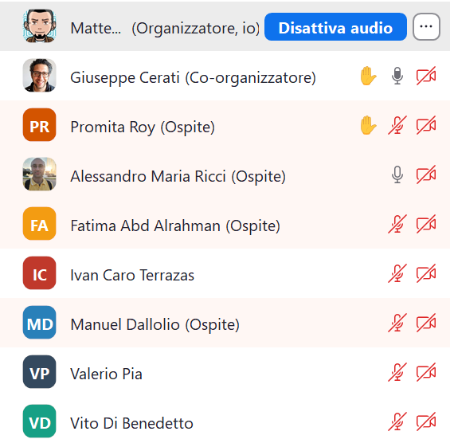
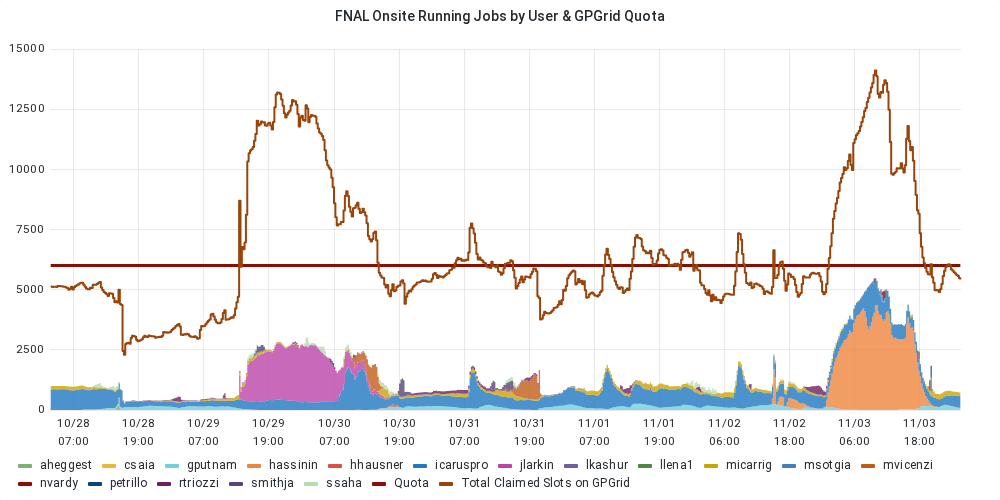
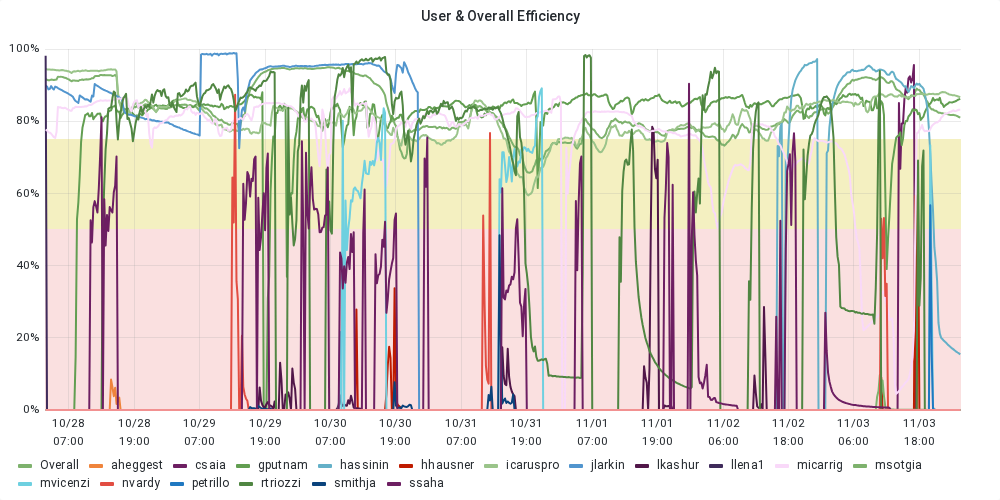
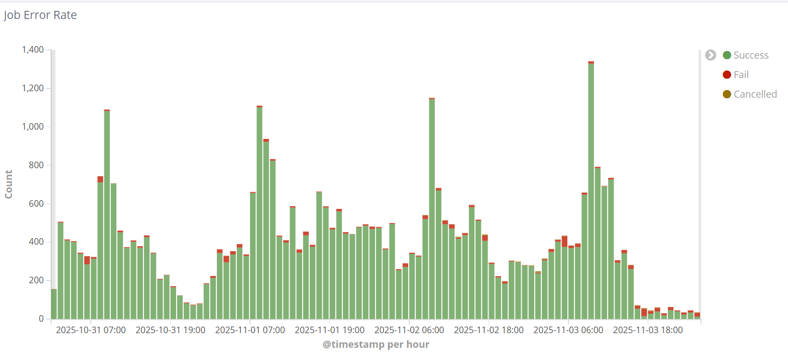
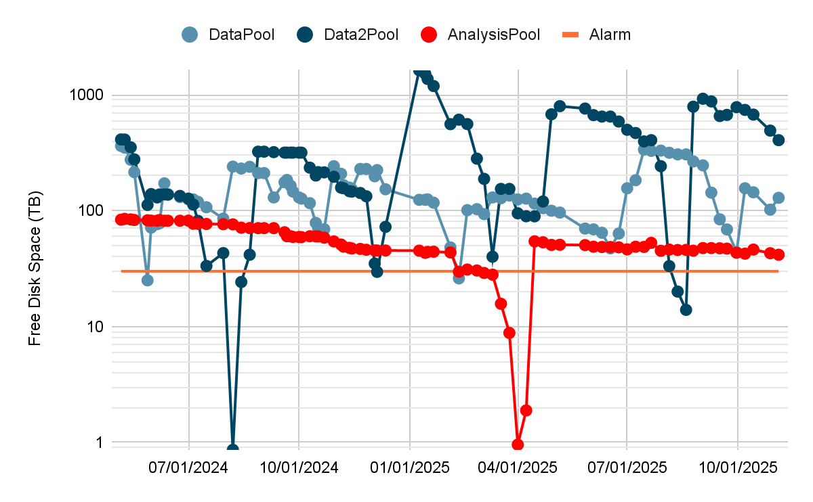
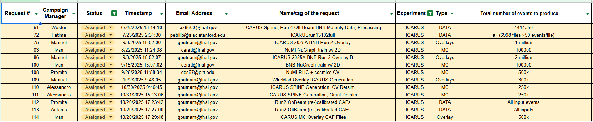

## Nov 4, 2025 9:00 AM CST | ICARUS Production Meeting

### Attendees

### Monitoring resource usage

| User Grid Usage History of the *Running Jobs by User* for the last 7 days: [link](https://fifemon.fnal.gov/monitor/d/000000053/experiment-batch-details?orgId=1&viewPanel=9&from=now-7d&to=now&var-experiment=icarus&var-pool=dune-global&var-pool=fifebatch) | User Job Efficiency History of the User Job Efficiency for the last 7 days: [link](https://fifemon.fnal.gov/monitor/d/000000022/experiment-efficiency-details?from=now-7d&to=now&var-experiment=icarus&var-pool=dune-global&var-pool=fifebatch&orgId=1&viewPanel=2) |
| ----- | ----- |
|  |  |
| **Icaruspro Jobs Exit Code** History of the icaruspro job exit code for the last 7 days: [link](https://landscape.fnal.gov/kibana/app/kibana#/dashboard/ba047b90-b8ca-11e7-989a-91951b87e80a?_g=\(refreshInterval:\(pause:!t,value:0\),time:\(from:now-4d,mode:relative,to:now\)\)&_a=\(description:'View%20jobs%20exit%20code,%20where%20they%20ran,%20and%20logs',filters:!\(\('$state':\(store:appState\),meta:\(alias:!n,disabled:!f,index:'fifebatch-history-*',key:pool,negate:!f,params:\(query:fifebatch,type:phrase\),type:phrase,value:fifebatch\),query:\(match:\(pool:\(query:fifebatch,type:phrase\)\)\)\),\('$state':\(store:appState\),meta:\(alias:!n,disabled:!f,index:'fifebatch-history-*',key:User,negate:!f,params:\(query:'icaruspro@fnal.gov',type:phrase\),type:phrase,value:'icaruspro@fnal.gov'\),query:\(match:\(User:\(query:'icaruspro@fnal.gov',type:phrase\)\)\)\),\('$state':\(store:appState\),meta:\(alias:!n,disabled:!f,index:'fifebatch-history-*',key:Jobsub_Group,negate:!f,params:\(query:icarus,type:phrase\),type:phrase,value:icarus\),query:\(match:\(Jobsub_Group:\(query:icarus,type:phrase\)\)\)\)\),fullScreenMode:!f,options:\(darkTheme:!f\),panels:!\(\(embeddableConfig:\(vis:\(colors:\(Cancelled:%23967302,Fail:%23BF1B00,Success:%23629E51\),legendOpen:!t\)\),gridData:\(h:15,i:'1',w:40,x:0,y:0\),id:'2f40f420-b8ca-11e7-989a-91951b87e80a',panelIndex:'1',type:visualization,version:'6.8.23'\),\(gridData:\(h:10,i:'2',w:24,x:24,y:15\),id:'569cca30-b8ca-11e7-989a-91951b87e80a',panelIndex:'2',type:visualization,version:'6.8.23'\),\(gridData:\(h:10,i:'3',w:24,x:0,y:15\),id:'65759a00-b8ca-11e7-989a-91951b87e80a',panelIndex:'3',type:visualization,version:'6.8.23'\),\(embeddableConfig:\(columns:!\(JobsubJobId,Owner,ExitCode,ExitSignal,MATCH_GLIDEIN_Site,MachineAttrMachine0,stdout,stderr\),sort:!\('@timestamp',desc\)\),gridData:\(h:30,i:'4',w:48,x:0,y:25\),id:'7e94c3c0-b8cb-11e7-989a-91951b87e80a',panelIndex:'4',type:search,version:'6.8.23'\),\(gridData:\(h:15,i:'5',w:8,x:40,y:0\),id:AWZpvkXbLj3wKbt0N_Vp,panelIndex:'5',type:visualization,version:'6.8.23'\)\),query:\(language:lucene,query:\(match_all:\(\)\)\),timeRestore:!f,title:'Fifebatch%20History',viewMode:view\)) | **SBN Data Pools** [link](https://fifemon.fnal.gov/monitor/d/rflbgV-iz/dcache-by-poolgroup?orgId=1&var-PoolGroup=SbnData2Pools&from=now-3h&to=now&refresh=5m) |
|  |  |
| Dcache Persistent Usage per user Total is 114 TB: [link](https://fifemon.fnal.gov/monitor/d/000000175/dcache-persistent-usage-by-vo?orgId=1&var-VO=icarus) |  |
|  |  |

### Production requests

| 2025 Not-Completed Production Requests |
| ----- |
|  |

Link to [spreadsheet](https://docs.google.com/spreadsheets/d/1ffBp475tEzlRilFs7xLhbevSZHjsuk1Dm5FGFIPWsFM/edit?gid=1567393491#gid=1567393491)  
Link to [github project](https://github.com/orgs/SBNSoftware/projects/49)

### Active Campaigns in POMS

| Campaign Name | ID | Creator | Note |
| :---- | :---- | :---- | :---- |
| 2025\_ICARUS\_BNB\_RUN2\_OFFV2\_SBN | 10495 | agioiosa | \#113 |
| 2025A\_ICARUS\_SPINE\_detsim\_CV\_NERSC | 10442 | amricci | \#110 |
| 2025A\_ICARUS\_Overlays\_BNB\_RUN2 | 10165 | manueld | \#75, \#86 |
| 2025\_ICARUS\_BNB\_Run2\_v10\_SBN | 10070 | manueld | ?? |
| ICARUS\_keepup | 9442 | icaro | 11keepup |

Link [here](https://pomsgpvm02.fnal.gov/poms/show_campaigns/icarus/production)

### Notes

* 

### Requests

* Assigned:  
  * Request \#61 \[Thomas\]: \[RUN4\]   
    1. Reprocessing for the RUN4 with calibration not started yet  
  * Request  \#72 \[Fatima\]:   
    1. Still running. Approximately 90% of the request is complete from stage zero.  
  * Request \#75 \[Manuel/Ivan\]:  
    1. Everything concerning normal overlays has been stopped  
  * Request \#86 \[Manuel/Ivan\]:   
    1. See \#75. Everything concerning normal overlays has been stopped  
  * Request \#100 \[Ivan\]: 	  
    1. Done. Info missing in the db  
  * Request \#108 \[Promita\]: 	  
    1. The test ran fine. Campaign not yet submitted. Waiting for input from SPINE people. There is some issue that spine people are still looking at  
  * Request \#109 \[Manuel\]:  
    1. It is running. It has picked up a lot of speed after some jobs were moved out of places like FermiGrid. There are only 3,500 jobs left in idle, and approximately 300 are running at the moment  
  * Request \#110, \#111 \[Alessandro\]:  
    1. The campaign for requests 110 and 111 is being run @ Polaris, but the current effort is concentrated directly on request 111\. Initial test jobs for request 111 ran successfully, but a new test was launched after Gray asked to produce LArCV files, necessitating a change to the configuration file. If this new test runs successfully, the request 111 campaign will be considered ready for production. Request 110 is pending because Gray requested that request 111 be processed first  
  * Request \#112 \[Promita\]:  
    1. The campaign had started but was subsequently paused. This pause was instituted because there were files from a previous run 2 reprocessing (without calibrations) that needed to be recovered first, and running both campaigns simultaneously was deemed inefficient due to similar resource requirements  
  * Request \#113 \[Antonio\]:  
    1. Running test or full production  
    2. CAF files with calibrations and updated file format, Run 2 off-beam data  
  * Request \#114 \[Ivan\]:  
    1. The campaign is still running offsite exclusively, which was done under requests from Gray

### Action Items and Open issue

* Link to [action items](https://github.com/orgs/SBNSoftware/projects/32)  
* \[Promita\] By the end of the previous Tuesday, one of the four shared datasets had been successfully deleted, resulting in the clearance of approximately 80 TB of disk space. However, the deletion process was immediately interrupted after a message was received from Mike requesting that the campaign be paused. This required pause stemmed from an investigation being conducted by Mike's team into an observed spine issue within the transparency maps. Due to this issue, there was concern that a reprocessing or revisiting of the samples might be necessary. Since one sample had already been deleted, no further action could be taken regarding that specific dataset, but three other samples remain. The campaign is currently awaiting a final confirmation or "heads up" from Mike before proceeding with the deletion of those remaining samples.  
* \[Matteo\] *icaruscode* reproducibility: update [here](https://shortbaseline.slack.com/docs/T7P7C3UAK/F09QMA3EGJD).   
  * For Stage Zero, the root-diff utility identified differing branches. This mismatch appears to be caused by an uninitialized variable, and a pull request is currently open to address the issue. In contrast, the Stage Zero supplemental files were reported as okay.  
  * The Stage One files were also reported as okay. However, the Stage One supplemental files showed differences. Specific branches found to be different include:  
    1. **caloskimE/TrackCaloSkim** field, which is different due to an uninitialized variable (with a pull-request opened).  
    2. **CRTDataAnalysis/HitTree** (specifically the run and subrun fields), which is also different due to an uninitialized variable (with a pull-request opened).  
    3. **cluster3DCryoE/monitoring**, which is different but was deemed by Tracy as not critical and ignorable.  
  * Previously, **recob::SpacePoints\_cluster3DCryoW\_\_stage1.obj** were reported as different by root-diff executable, but they are actually not different. The executable incorrectly reports them as different because it assumes that three specific variables are equal. Since the buffer created for comparison is sometimes only partially filled (when the reported header length is inconsistent with the actual data size), the comparison involves uninitialized variable areas, leading to the erroneous difference report. The remaining question is why the object length reported in the Tkey function is not the actual length.  
  * The next step in the reproducibility effort is to compare this processing in different machines by submitting jobs and requiring the same CPU model to determine if the results are identical.

### CNAF

* **RUN3 Processing:**  
  * 96% of file submitted, 76% of files successfully processed. The difference is mostly due to files still being processed, with just some runs that failed due to proxy reasons. I expect to have all the file submitted by the end of today or tomorrow. After that we’ll start to recover the failed ones. Disk wise, we have 160 TB available and we’ll likely need to delete something at some point. Run3 offbeam is being transferred, I would say we are at about 75%

### Keepup

* \[Ivan\]:   
  * NTR

### Infrastructure

* \[Giuseppe\]:  
  * Material for FRSG started to be prepared. The Monte Carlo workflow was run to test the timing and memory usage. Ivan provided the numbers for the overlay production. It was confirmed that the big bottleneck remains the memory usage. Regarding the FCSG effort, there might be a meeting on Thursday to give a preview, contingent upon having enough time to prepare meaningful content to show.

### Software

* \[Tracy\]:   
  * NTR

### Computing

* \[Vito\]:  
  * An entry was set up last week at NERSC with the configuration needed to run Triton. It is currently mostly a placeholder, as the model must eventually be included. However, the setup itself should be ready. When a release that can utilize the threat (Triton) server becomes ready, tests can begin at NERSC, and eventually, a campaign could run there if required.  
  * A similar setup may also eventually run at FermiGrid. Vito mentioned that GPU nodes at FermiGrid have been tested in the past few weeks and appear to be able to accept GPU requests.
