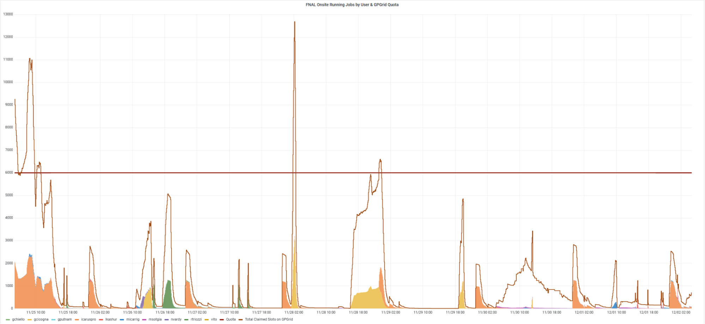
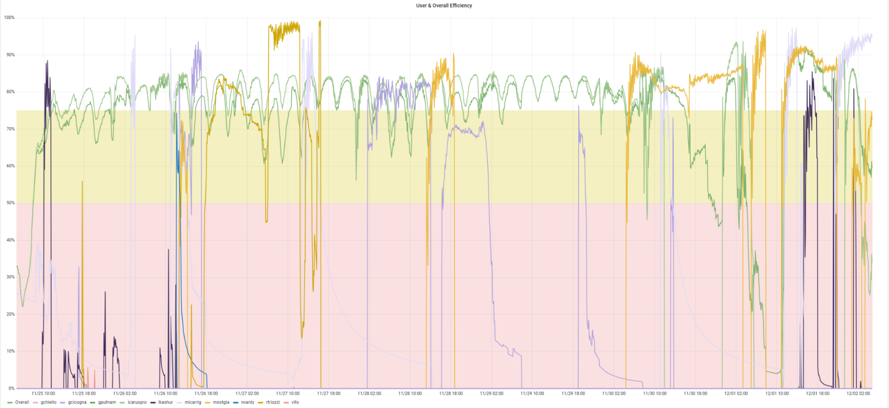
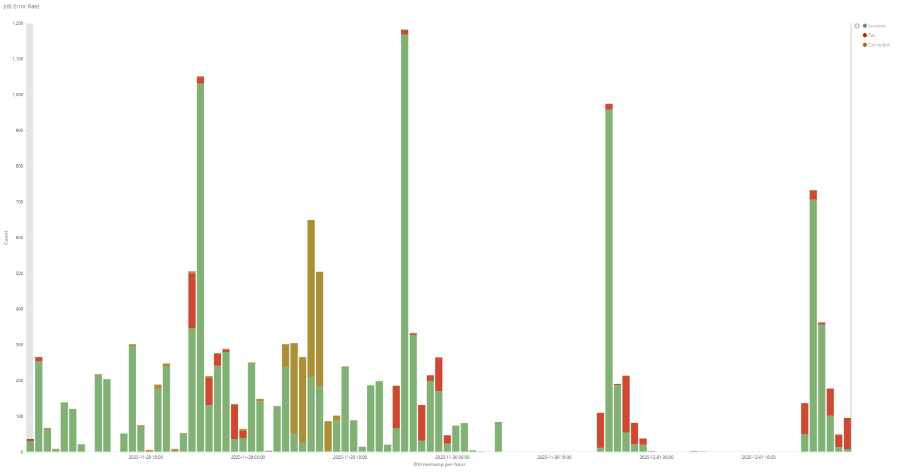
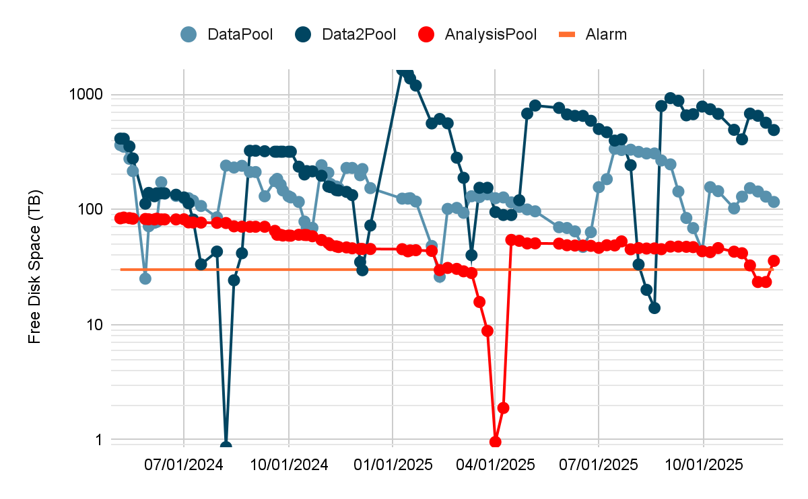
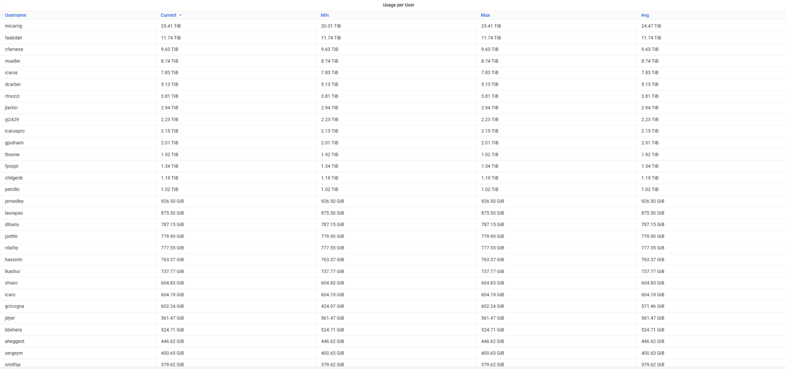
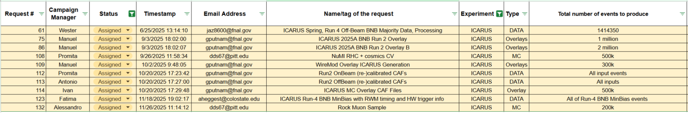

## Dec 2, 2025 9:00 AM CST | ICARUS Production Meeting

### Attendees

Alessandro, Giuseppe, Vito, Christian, Francesco, Fatima, Ivan, Matteo, Manuel

### Monitoring resource usage

| User Grid Usage History of the *Running Jobs by User* for the last 7 days: [link](https://fifemon.fnal.gov/monitor/d/000000053/experiment-batch-details?orgId=1&viewPanel=9&from=now-7d&to=now&var-experiment=icarus&var-pool=dune-global&var-pool=fifebatch) | User Job Efficiency History of the User Job Efficiency for the last 7 days: [link](https://fifemon.fnal.gov/monitor/d/000000022/experiment-efficiency-details?from=now-7d&to=now&var-experiment=icarus&var-pool=dune-global&var-pool=fifebatch&orgId=1&viewPanel=2) |
| ----- | ----- |
|  |  |
| **Icaruspro Jobs Exit Code** History of the icaruspro job exit code for the last 7 days: [link](https://landscape.fnal.gov/kibana/app/kibana#/dashboard/ba047b90-b8ca-11e7-989a-91951b87e80a?_g=\(refreshInterval:\(pause:!t,value:0\),time:\(from:now-4d,mode:relative,to:now\)\)&_a=\(description:'View%20jobs%20exit%20code,%20where%20they%20ran,%20and%20logs',filters:!\(\('$state':\(store:appState\),meta:\(alias:!n,disabled:!f,index:'fifebatch-history-*',key:pool,negate:!f,params:\(query:fifebatch,type:phrase\),type:phrase,value:fifebatch\),query:\(match:\(pool:\(query:fifebatch,type:phrase\)\)\)\),\('$state':\(store:appState\),meta:\(alias:!n,disabled:!f,index:'fifebatch-history-*',key:User,negate:!f,params:\(query:'icaruspro@fnal.gov',type:phrase\),type:phrase,value:'icaruspro@fnal.gov'\),query:\(match:\(User:\(query:'icaruspro@fnal.gov',type:phrase\)\)\)\),\('$state':\(store:appState\),meta:\(alias:!n,disabled:!f,index:'fifebatch-history-*',key:Jobsub_Group,negate:!f,params:\(query:icarus,type:phrase\),type:phrase,value:icarus\),query:\(match:\(Jobsub_Group:\(query:icarus,type:phrase\)\)\)\)\),fullScreenMode:!f,options:\(darkTheme:!f\),panels:!\(\(embeddableConfig:\(vis:\(colors:\(Cancelled:%23967302,Fail:%23BF1B00,Success:%23629E51\),legendOpen:!t\)\),gridData:\(h:15,i:'1',w:40,x:0,y:0\),id:'2f40f420-b8ca-11e7-989a-91951b87e80a',panelIndex:'1',type:visualization,version:'6.8.23'\),\(gridData:\(h:10,i:'2',w:24,x:24,y:15\),id:'569cca30-b8ca-11e7-989a-91951b87e80a',panelIndex:'2',type:visualization,version:'6.8.23'\),\(gridData:\(h:10,i:'3',w:24,x:0,y:15\),id:'65759a00-b8ca-11e7-989a-91951b87e80a',panelIndex:'3',type:visualization,version:'6.8.23'\),\(embeddableConfig:\(columns:!\(JobsubJobId,Owner,ExitCode,ExitSignal,MATCH_GLIDEIN_Site,MachineAttrMachine0,stdout,stderr\),sort:!\('@timestamp',desc\)\),gridData:\(h:30,i:'4',w:48,x:0,y:25\),id:'7e94c3c0-b8cb-11e7-989a-91951b87e80a',panelIndex:'4',type:search,version:'6.8.23'\),\(gridData:\(h:15,i:'5',w:8,x:40,y:0\),id:AWZpvkXbLj3wKbt0N_Vp,panelIndex:'5',type:visualization,version:'6.8.23'\)\),query:\(language:lucene,query:\(match_all:\(\)\)\),timeRestore:!f,title:'Fifebatch%20History',viewMode:view\)) | **SBN Data Pools** [link](https://fifemon.fnal.gov/monitor/d/rflbgV-iz/dcache-by-poolgroup?orgId=1&var-PoolGroup=SbnData2Pools&from=now-3h&to=now&refresh=5m) |
|  |  |
| Dcache Persistent Usage per user Total is 114 TB: [link](https://fifemon.fnal.gov/monitor/d/000000175/dcache-persistent-usage-by-vo?orgId=1&var-VO=icarus) |  |
|  |  |

### Production requests

| 2025 Not-Completed Production Requests |
| ----- |
|  |

Link to [spreadsheet](https://docs.google.com/spreadsheets/d/1ffBp475tEzlRilFs7xLhbevSZHjsuk1Dm5FGFIPWsFM/edit?gid=1567393491#gid=1567393491)  
Link to [github project](https://github.com/orgs/SBNSoftware/projects/49)

### Active Campaigns in POMS

| Campaign Name | ID | Creator | Note |
| :---- | :---- | :---- | :---- |
| 2025A\_ICARUS\_SPINE\_detsim\_CV\_NERSC | 10442 | amricci | \#110 |
| ICARUS\_keepup | 9442 | icaro | keepup |
| 2025A\_ICARUS\_NuMI\_MC\_RHC | 9438 | amricci |  |

Link [here](https://pomsgpvm02.fnal.gov/poms/show_campaigns/icarus/production)

### Notes

* 

### Requests

* Assigned:  
  * Request \#61 \[Thomas\]: \[RUN4\]   
    1. MC: The main obstacle is related to the detsim which is consuming a considerable amount of memory. Checks are presently underway to either decrease the memory usage or identify an alternative solution that will allow it to run at Polaris.   
    2. Data: Reprocessing of Stage1 following the application of calibration not started yet; bnbmajority and the offbeambnbmajority have been processed utilizing the new DNNROI framework. However, the minbias has specifically not been processed for Run 4  
  * Request \#75 \[Manuel/Ivan\]:  
    1. Everything concerning normal overlays has been stopped  
  * Request \#86 \[Manuel/Ivan\]:   
    1. See \#75. Everything concerning normal overlays has been stopped  
  * Request \#108 \[Promita\]:  
    1. Currently running and is more than 50% complete. Stage0 is already done. Waiting for Stage1 to be completed  
  * Request \#109 \[Manuel\]:  
    1. Stage0 is done; waiting for stage1 fcl. Manuel to prompt about the Stage1 fcl file  
  * Request \#112 \[Promita\]:  
    1. Paused; Waiting for stage1 fcl  
  * Request \#113 \[Antonio\]:  
    1. Running test or full production  
    2. CAF files with calibrations and updated file format, Run 2 off-beam data  
  * Request \#114 \[Ivan\]:  
    1. The campaign is still running offsite exclusively, which was done under requests from Gray. To be restarted  
  * Request \#123 \[Fatima\]:  
    1. Assigned to Fatima  
  * Request \#132 \[Alessandro\]:  
    1. Assigned to Fatima

### Action Items and Open issue

* Link to [action items](https://github.com/orgs/SBNSoftware/projects/32)  
* \[Promita\] Datasample deletion campaign:  
* \[Matteo\] *icaruscode* reproducibility: ongoing. Here [details](https://shortbaseline.slack.com/docs/T7P7C3UAK/F0A0K0PRR16)  
* Michael Carrigan disk usage: is it ok?  
* \[Promita\] Investigate whether the issue that occurred with unusually high frequency at CNAF during RUN3 data processing is also present or was observed during RUN2 processing at FNAL.

### CNAF

* **RUN3 Processing**: 

### Keepup

* \[Ivan\]:   
  * Scripts have resilience issues \- plan to move them from Resilient to GitHub repo

### Infrastructure

* \[Giuseppe\]:  
  * FCRG meeting scheduled for next Thursday: Giuseppe and John have prepared numbers and are waiting for template slides. Practice session planned for later this week or early next week

### Software

* \[Tracy\]:   
  * NTR

### Computing

* \[Vito\]:   
  * 357k node hours remaining at NERSC (approximately 40,000 events worth). New NERSC allocation expected to start mid-January  
  * Exploring Brazilian computing center resources. Vito sent an email requesting account setup but no reply yet. Elio is working on the MOU for the allocation. Expected setup time is about one month once initiated
