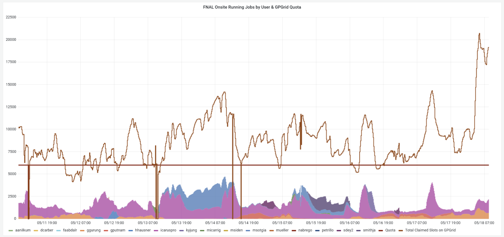
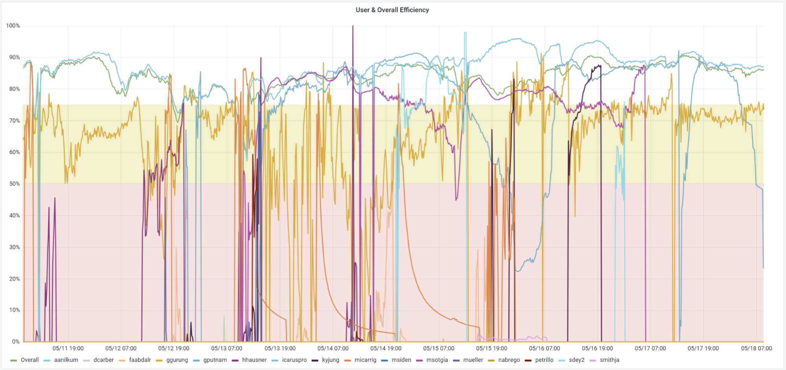
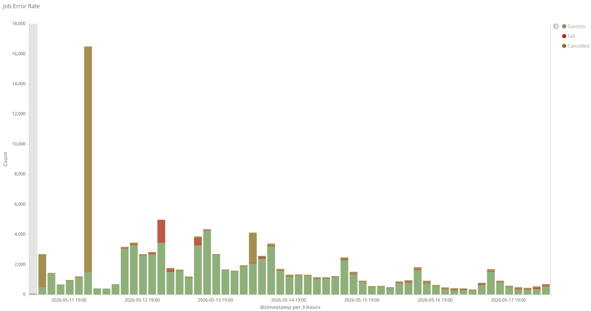
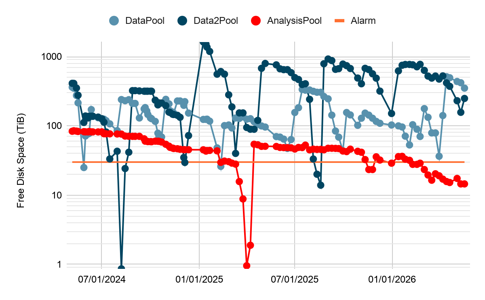
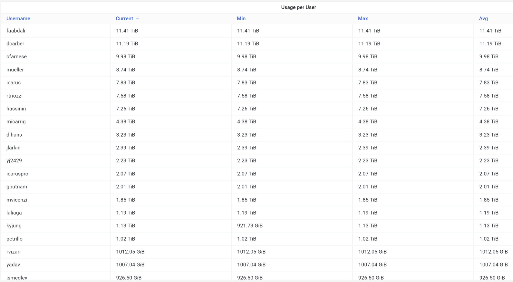
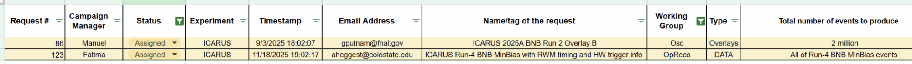
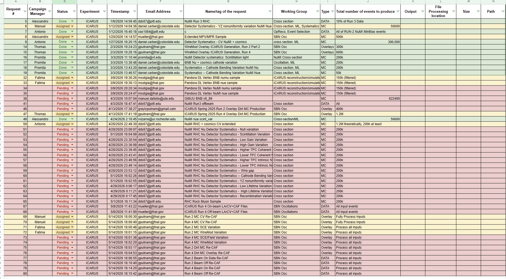
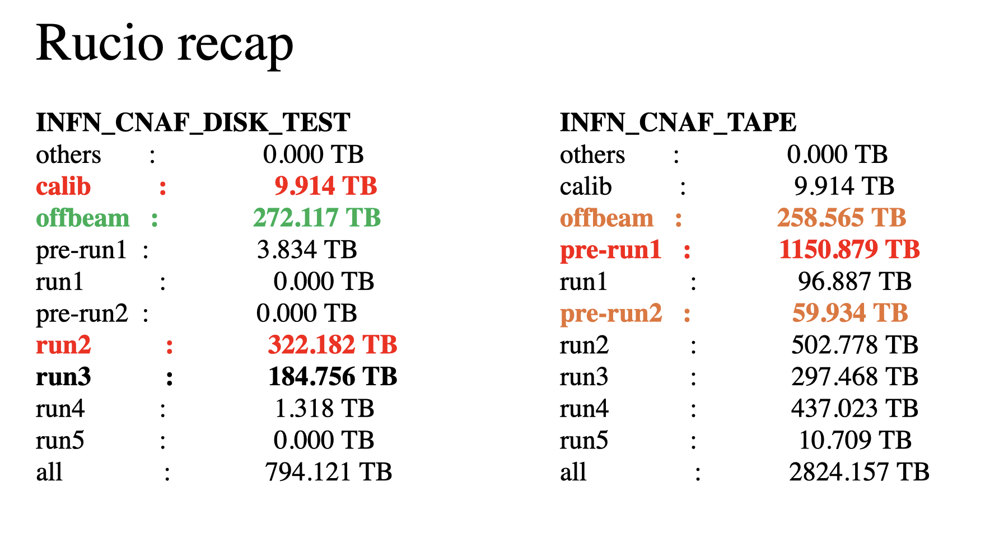

## mag 18, 2026 09:00 GMT-5 | ICARUS Production Meeting

### Attendees

Alessandro Maria Ricci, Daniel Carber, Fatima Abd Alrahman, Giuseppe Cerati, Tracy Usher, Promita Roy, Vito Di Benedetto, Manuel Dallolio

### Monitoring resource usage

| User Grid UsageHistory of the *Running Jobs by User* for the last 7 days: [link](https://fifemon.fnal.gov/monitor/d/000000053/experiment-batch-details?orgId=1&viewPanel=9&from=now-7d&to=now&var-experiment=icarus&var-pool=dune-global&var-pool=fifebatch)   | User Job EfficiencyHistory of the User Job Efficiency for the last 7 days: [link](https://fifemon.fnal.gov/monitor/d/000000022/experiment-efficiency-details?from=now-7d&to=now&var-experiment=icarus&var-pool=dune-global&var-pool=fifebatch&orgId=1&viewPanel=2)   |
| ----- | ----- |
| **Icaruspro Jobs Exit Code**History of the icaruspro job exit code for the last 7 days: [link](https://landscape.fnal.gov/kibana/app/kibana#/dashboard/ba047b90-b8ca-11e7-989a-91951b87e80a?_g=\(refreshInterval:\(pause:!t,value:0\),time:\(from:now-4d,mode:relative,to:now\)\)&_a=\(description:'View%20jobs%20exit%20code,%20where%20they%20ran,%20and%20logs',filters:!\(\('$state':\(store:appState\),meta:\(alias:!n,disabled:!f,index:'fifebatch-history-*',key:pool,negate:!f,params:\(query:fifebatch,type:phrase\),type:phrase,value:fifebatch\),query:\(match:\(pool:\(query:fifebatch,type:phrase\)\)\)\),\('$state':\(store:appState\),meta:\(alias:!n,disabled:!f,index:'fifebatch-history-*',key:User,negate:!f,params:\(query:'icaruspro@fnal.gov',type:phrase\),type:phrase,value:'icaruspro@fnal.gov'\),query:\(match:\(User:\(query:'icaruspro@fnal.gov',type:phrase\)\)\)\),\('$state':\(store:appState\),meta:\(alias:!n,disabled:!f,index:'fifebatch-history-*',key:Jobsub_Group,negate:!f,params:\(query:icarus,type:phrase\),type:phrase,value:icarus\),query:\(match:\(Jobsub_Group:\(query:icarus,type:phrase\)\)\)\)\),fullScreenMode:!f,options:\(darkTheme:!f\),panels:!\(\(embeddableConfig:\(vis:\(colors:\(Cancelled:%23967302,Fail:%23BF1B00,Success:%23629E51\),legendOpen:!t\)\),gridData:\(h:15,i:'1',w:40,x:0,y:0\),id:'2f40f420-b8ca-11e7-989a-91951b87e80a',panelIndex:'1',type:visualization,version:'6.8.23'\),\(gridData:\(h:10,i:'2',w:24,x:24,y:15\),id:'569cca30-b8ca-11e7-989a-91951b87e80a',panelIndex:'2',type:visualization,version:'6.8.23'\),\(gridData:\(h:10,i:'3',w:24,x:0,y:15\),id:'65759a00-b8ca-11e7-989a-91951b87e80a',panelIndex:'3',type:visualization,version:'6.8.23'\),\(embeddableConfig:\(columns:!\(JobsubJobId,Owner,ExitCode,ExitSignal,MATCH_GLIDEIN_Site,MachineAttrMachine0,stdout,stderr\),sort:!\('@timestamp',desc\)\),gridData:\(h:30,i:'4',w:48,x:0,y:25\),id:'7e94c3c0-b8cb-11e7-989a-91951b87e80a',panelIndex:'4',type:search,version:'6.8.23'\),\(gridData:\(h:15,i:'5',w:8,x:40,y:0\),id:AWZpvkXbLj3wKbt0N_Vp,panelIndex:'5',type:visualization,version:'6.8.23'\)\),query:\(language:lucene,query:\(match_all:\(\)\)\),timeRestore:!f,title:'Fifebatch%20History',viewMode:view\)) | **SBN Data Pools**[link](https://fifemon.fnal.gov/monitor/d/rflbgV-iz/dcache-by-poolgroup?orgId=1&var-PoolGroup=SbnData2Pools&from=now-3h&to=now&refresh=5m) |
|   |   |
| Dcache Persistent Usage per user Total is 114 TiB: [link](https://fifemon.fnal.gov/monitor/d/000000175/dcache-persistent-usage-by-vo?orgId=1&var-VO=icarus), Used space: 96.6 TiB (87.2%) |   |
|   |  |

### **Production requests**

| 2025 Ongoing/Pending Production Requests |
| ----- |
|   |
| **2026 Ongoing/Pending Production Requests[Link](https://docs.google.com/spreadsheets/d/1ffBp475tEzlRilFs7xLhbevSZHjsuk1Dm5FGFIPWsFM/edit?gid=588919686#gid=588919686)** |
|   |

Link to [spreadsheet](https://docs.google.com/spreadsheets/d/1ffBp475tEzlRilFs7xLhbevSZHjsuk1Dm5FGFIPWsFM/edit?gid=1567393491#gid=1567393491)  
Link to [github project](https://github.com/orgs/SBNSoftware/projects/49)

### 

POMS active campaigns [here](https://pomsgpvm02.fnal.gov/poms/show_campaigns/icarus/production)

### Notes

* 

### Requests

* Priority:  
  * Requests 69-78  
  * Requests 67-68, 79-80  
  * Increasing statistics of BNB Run2 Overlay B  
  * Requests 51-65

* Assigned:  
  * Request \#86 \[Manuel/Alessandro\]:  
    1. paused  
          
  * Request \#123 \[Fatima\]:  
    1. 97% is complete (1230 files remained)

  * Request \#6 \[Manuel\]:  
    1. Rerun stage1 and save it with a different same def  
    2. Old datasets not retired yet \-\> retiring

    

  * Request \#8 \[Alessandro\]: Perlmutter and FermiGrid  
    1. Stage0: 74% complete  
    2. Larcv: 56% complete  
    3. TRANSFERRING in S3DF

  * Request \#17 \[Promita\]: 100% complete 

  * Request \#32-33 \[Fatima\]:  
    1. 32: test, paused  
    2. 33: test, paused  
         
  * Request \#47 \[Thomas\]: Aurora

  * Request \#50 \[Antonio\]: test complete

  * Request \#69-70 \[Manuel\]

  * Request \#71-72 \[Fatima\]

### Action Items and Open issue

* Link to [action items](https://github.com/orgs/SBNSoftware/projects/32)

* **Storage:** 438 TiB free on SBNDataPool.  
    
* \[Matheus/Giuseppe\] SBND is using some space in SBNDataPool. Some SBND datasets can be deleted \-\> still 6 TiB can be recovered. Totally, we recovered **22 TiB**.

* \[Vito/Antonio\] **Transfer of Run2 compressed files to Tape** **(420 TB), some TBs in DataPool2 as well** 100% complete \-\> Deleting on disk ongoing  
  The transfer to tape has been split by data stream, the selection was based on origin path, we can update the config to delete the BNB data streams selectively, we have  
  run2\_compressed\_bnbmajority\_SBNDATA \-\> DELETED run2\_compressed\_bnbmajority\_SBNDATA2 \-\> DELETED  
  run2\_compressed\_bnbminbias\_SBNDATA \-\> DELETED  
  run2\_compressed\_bnbminbias\_SBNDATA2 \-\> DELETED  
  run2\_compressed\_offbeambnbmajority\_SBNDATA \-\> DELETED  
  run2\_compressed\_offbeambnbmajority\_SBNDATA2 \-\> DELETED  
  run2\_compressed\_offbeambnbminbias\_SBNDATA \-\> DELETED  
  run2\_compressed\_offbeambnbminbias\_SBNDATA2 \-\> DELETED  
  SBNDATA/SBNDATA2 suffix is to select files from one of SBNDataPools/SBNData2Pools  
  **Keep a subset of bnbmajority compressed raw data (run 9435\)**  
  (25 files present a mismatch between tape and disk version, they have not been deleted)  
    
* \[Alessandro\] Transfer of stage1 run2 to tape:  
  * Icaruspro\_2024\_Run2\_production\_Reproc\_Run2\_v09\_89\_01\_01p03\_bnbmajority\_stage1 (90 TB) \-\> COMPLETED  
  * Icaruspro\_2024\_Run2\_production\_Reproc\_Run2\_v09\_89\_01\_01p03\_offbeambnbmajority\_stage1 (70 TB) \-\> COMPLETED  
  * icaruspro\_production\_v09\_89\_01\_01\_2024A\_ICARUS\_MC\_Sys\_NuCos\_2024A\_MC\_Sys\_NuCos\_CV\_2ndV\_stage1 (51 TB) \-\> COMPLETED

### CNAF

* **RUN3 Processing**:   
  **Valerio and his team:** they have processed 100% of on- and off-beam, both bnbmajority and bnbminbias. Now the Italian team is processing the Calibration. Then, stage1 and caf will be reprocessed. **CNAF is full at 99%. Calibration is ongoing.**

* STORAGE:

* Production:  
    
  \=====================================================  
  \==  /storage/gpfs\_data/icarus/plain/data  
  \=====================================================  
  test                 :                0.112 TB  
      mc-v10\_06\_00\_01p01-202603-cnaf-numi-nue-disap\_test :                0.000 TB  
      mc\_from\_list\_test :                0.005 TB  
      mc-v10\_06\_00\_01p01-20260409-cnaf-dnu-test\_standard :                0.000 TB  
      \-v10\_06\_00\_01p01-202603-cnaf-numi-nue-disap-cv-testvar :                0.000 TB  
      \-v10\_06\_00\_01p01-202603-cnaf-numi-nue-disap-cv-nueonly :                0.000 TB  
      mc-v10\_06\_00\_01p01-202603-cnaf-numi-nue-disap\_variations :                0.000 TB  
      \-v10\_06\_00\_01p01-202603-cnaf-numi-nue-disap-cv :                0.000 TB  
      mc-v10\_06\_00\_01p01-202603-cnaf-numi-nue-disap-cv-nueonly :                0.000 TB  
      mc-v10\_06\_00\_01p01-20260409-cnaf-dnu\_m100 :                0.000 TB  
      \-processing-cnaf-1025-v10\_06\_00\_04p03 :                0.000 TB  
      mc-v10\_06\_00\_01p01-202603-cnaf-numi-nue-disap-cv :                0.107 TB  
  mc                   :              174.763 TB  
      mc-v0989-extendedCV-BNB :                1.050 TB  
      prodcorsika\_proton\_intime\_icarus\_bnb\_sce\_1d\_drift\_on\_MC-v09\_87\_00-042024-cnaf :               10.290 TB  
      mc-v09\_84\_00\_01-202412-cnaf-corrsce :                2.814 TB  
      mc-v10\_06\_00\_01p01-202603-cnaf-numi-nue-disap\_variations :               97.188 TB  
      mc-v09\_84\_00\_01-202403-cnaf-corrsce :                3.020 TB  
      mc-v10\_06\_00\_01p01-202603-cnaf-numi-nue-disap-cv-nueonly :                7.479 TB  
      mc-v10\_06\_00\_01p01-202603-cnaf-numi-nue-disap-cv :               52.921 TB  
  prod                 :              727.291 TB  
      run2-v09\_84\_00\_01-202403-cnaf :               95.381 TB  
      run2-v09\_72\_00\_06-202312-cnaf :                5.691 TB  
      run2-v09\_83\_01-202402-cnaf :                0.000 TB  
      run3-processing-cnaf-1025-v10\_06\_00\_04p03 :              611.608 TB  
      run1-v09\_72\_00\_05p03-202311-cnaf :                3.217 TB  
      run9435-v09\_84\_00\_01-202403-cnaf :               10.793 TB  
      run2-v09\_89\_01\_01p03-202412-fnal :                0.602 TB  
  all                  :              902.167 TB

* Rucio:  
     
    
* \[Valerio\] delete of Run 2 raw data

### Keepup Manager \[Nobody\]

### Data Manager \[Nobody\]

* \[Promita\]: update the available samples in SBN Production wiki.  
* Investigate:  
  * \[Alessandro\] /data\_stage1 TO BE DELETED  
  * \[Alessandro\] /icarus\_keepup, ask for calibration ntuples of run3-run5 because we have multiple copies  
  * \[Giuseppe\] /mc/2025A\_ICARUS\_NuGraph2  
  * \[Manuel\] BNB Overlay campaign: check if we can remove some versions  
  * \[Promita\] run3 specific runs with PMT wave forms?

### Infrastructure

* \[Fatima\]: **ICARUS data available on the SBN SAM instance.** SBND has developed scripts to help with the migration, so it might be good to coordinate with them how to move forward.

### Software

* \[Matteo\]: *icaruscode* reproducibility: ongoing. Here [details](https://shortbaseline.slack.com/docs/T7P7C3UAK/F0A0K0PRR16). Matteo checks with Jacob Smith, the release manager. You discovered that the issue was related to the initialization of some variables. We are waiting for a new Production release. The fix is not present is in icaruscode v10\_06\_00\_06p03.

### Computing

* \[Vito\]:  
  * Token in FTS tested but not used in production for the moment.  
  * Files must be transferred manually to NERSC. Rucio is setting up to transfer files with NERSC. Rucio also uses a proxy, need to use tokens.  
  * Updated SAM configuration to run jobs with input files at NERSC \-\> TO BE TESTED  
  * The files in Resilient are deleted after 30 days automatically if they are not used.  
  * My test to use the RUCIO RSE FNAL\_LARCV doesn't seem to work, the test file shows only on FNAL dCache, but I'm not sure if SLAC RUCIO RSE is working, last week I reached out to Francois, but no answer so far.  
  * Split campaigns in slice running at maximum one week to avoid the file saved in scratch are lost.  
  * Wednesday 20th, dcache, gpvm node maintenance, 3 hours.  
  * NERSC: 33% node-hours CPU remained over 10000