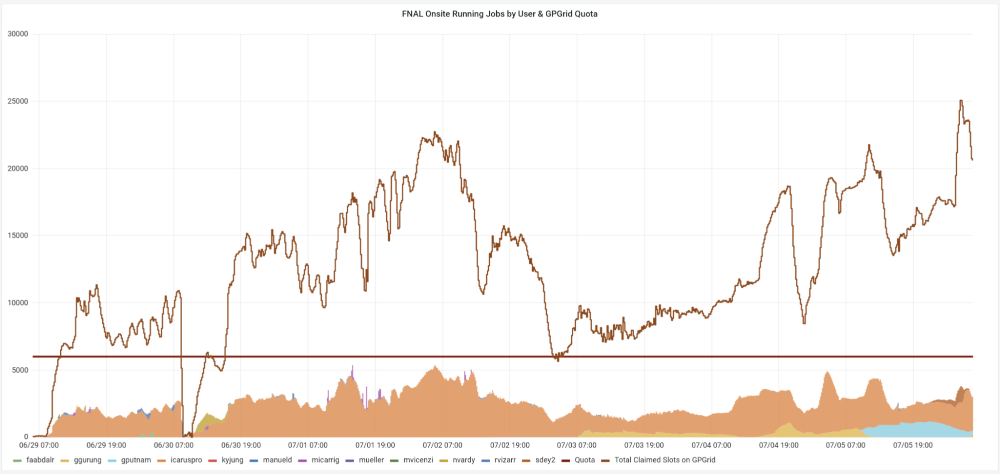
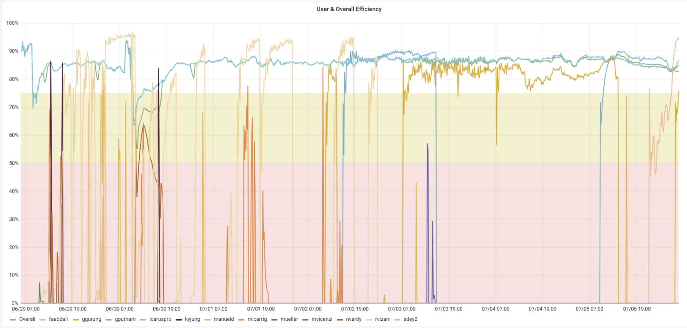
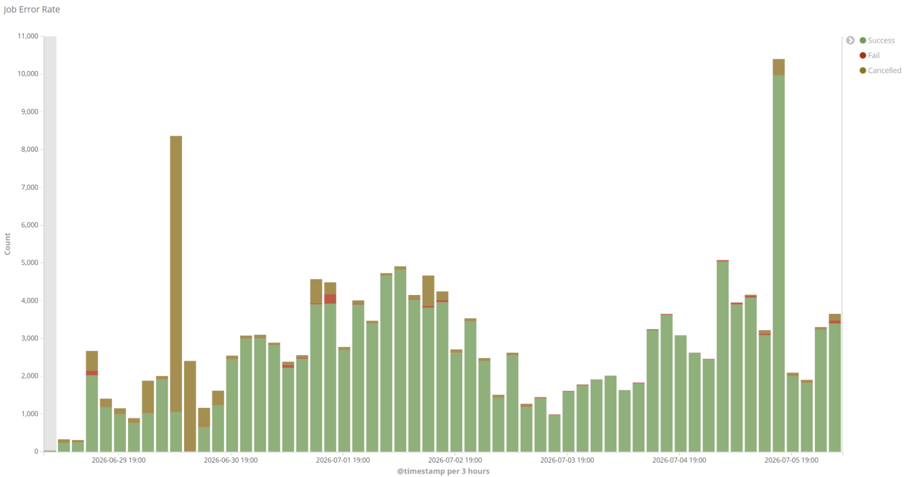
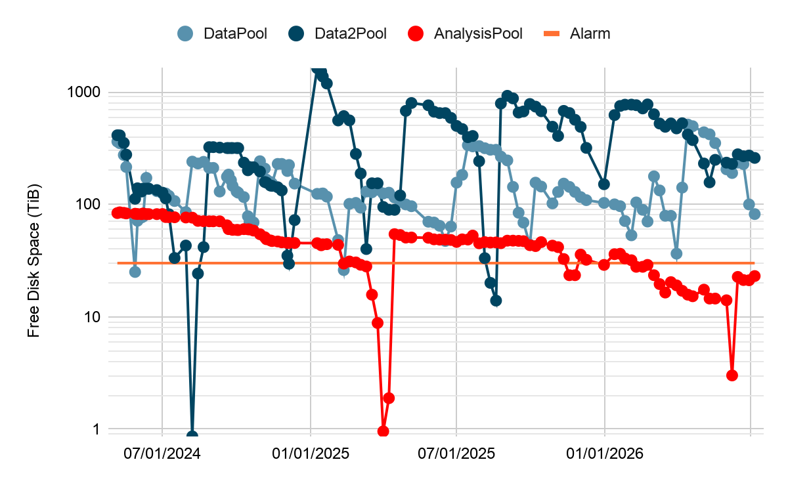
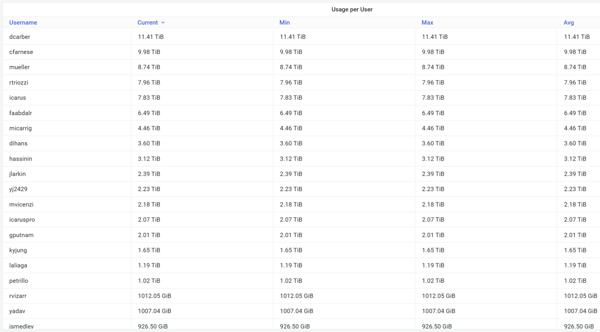
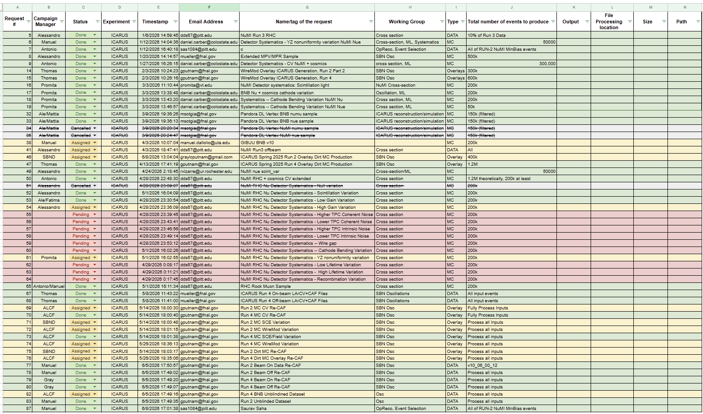

# ICARUS Data Production and Management Meeting

## lug 6, 2026 09:00 GMT-5

## Attendees

Alessandro Maria Ricci, Vito Di Benedetto, Gianmarco Cucciniello, Matthew Siden, Saurav Saha, Dihan Senadheera, Fatima Abd Alrhaman

# Monitor

| User Grid UsageHistory of the Running Jobs by User for the last 7 days: [link](https://fifemon.fnal.gov/monitor/d/000000053/experiment-batch-details?orgId=1&viewPanel=9&from=now-7d&to=now&var-experiment=icarus&var-pool=dune-global&var-pool=fifebatch)  | User Job EfficiencyHistory of the User Job Efficiency for the last 7 days: [link](https://fifemon.fnal.gov/monitor/d/000000022/experiment-efficiency-details?from=now-7d&to=now&var-experiment=icarus&var-pool=dune-global&var-pool=fifebatch&orgId=1&viewPanel=2)  |
| ----- | ----- |
| **Icaruspro Jobs Exit Code**History of the icaruspro job exit code for the last 7 days: [link](https://landscape.fnal.gov/kibana/app/kibana#/dashboard/ba047b90-b8ca-11e7-989a-91951b87e80a?_g=\(refreshInterval:\(pause:!t,value:0\),time:\(from:now-4d,mode:relative,to:now\)\)&_a=\(description:'View%20jobs%20exit%20code,%20where%20they%20ran,%20and%20logs',filters:!\(\('$state':\(store:appState\),meta:\(alias:!n,disabled:!f,index:'fifebatch-history-*',key:pool,negate:!f,params:\(query:fifebatch,type:phrase\),type:phrase,value:fifebatch\),query:\(match:\(pool:\(query:fifebatch,type:phrase\)\)\)\),\('$state':\(store:appState\),meta:\(alias:!n,disabled:!f,index:'fifebatch-history-*',key:User,negate:!f,params:\(query:'icaruspro@fnal.gov',type:phrase\),type:phrase,value:'icaruspro@fnal.gov'\),query:\(match:\(User:\(query:'icaruspro@fnal.gov',type:phrase\)\)\)\),\('$state':\(store:appState\),meta:\(alias:!n,disabled:!f,index:'fifebatch-history-*',key:Jobsub_Group,negate:!f,params:\(query:icarus,type:phrase\),type:phrase,value:icarus\),query:\(match:\(Jobsub_Group:\(query:icarus,type:phrase\)\)\)\)\),fullScreenMode:!f,options:\(darkTheme:!f\),panels:!\(\(embeddableConfig:\(vis:\(colors:\(Cancelled:%23967302,Fail:%23BF1B00,Success:%23629E51\),legendOpen:!t\)\),gridData:\(h:15,i:'1',w:40,x:0,y:0\),id:'2f40f420-b8ca-11e7-989a-91951b87e80a',panelIndex:'1',type:visualization,version:'6.8.23'\),\(gridData:\(h:10,i:'2',w:24,x:24,y:15\),id:'569cca30-b8ca-11e7-989a-91951b87e80a',panelIndex:'2',type:visualization,version:'6.8.23'\),\(gridData:\(h:10,i:'3',w:24,x:0,y:15\),id:'65759a00-b8ca-11e7-989a-91951b87e80a',panelIndex:'3',type:visualization,version:'6.8.23'\),\(embeddableConfig:\(columns:!\(JobsubJobId,Owner,ExitCode,ExitSignal,MATCH_GLIDEIN_Site,MachineAttrMachine0,stdout,stderr\),sort:!\('@timestamp',desc\)\),gridData:\(h:30,i:'4',w:48,x:0,y:25\),id:'7e94c3c0-b8cb-11e7-989a-91951b87e80a',panelIndex:'4',type:search,version:'6.8.23'\),\(gridData:\(h:15,i:'5',w:8,x:40,y:0\),id:AWZpvkXbLj3wKbt0N_Vp,panelIndex:'5',type:visualization,version:'6.8.23'\)\),query:\(language:lucene,query:\(match_all:\(\)\)\),timeRestore:!f,title:'Fifebatch%20History',viewMode:view\)) | **SBN Data Pools**History of the SBN Data Pools: [link](https://fifemon.fnal.gov/monitor/d/rflbgV-iz/dcache-by-poolgroup?orgId=1&var-PoolGroup=SbnDataPools&from=now-3h&to=now&refresh=5m) |
|  |  |
| **Dcache Persistent Usage per User** Total is 114 TiB: [link](https://fifemon.fnal.gov/monitor/d/000000175/dcache-persistent-usage-by-vo?orgId=1&var-VO=icarus), Used space: 92.9 TiB (81.2%) |   |
|  |  |

### 

# Data Production

| 2026 ICARUS Requests [Link](https://docs.google.com/spreadsheets/d/1ffBp475tEzlRilFs7xLhbevSZHjsuk1Dm5FGFIPWsFM/edit?gid=588919686#gid=588919686) |
| ----- |
|  |

Link to [SBN spreadsheet](https://docs.google.com/spreadsheets/d/17mFPGsP7gw4GRLSCwIL15QrtUnLVri_2k2Wjzhd6Ork/edit?gid=1971194639#gid=1971194639)  
Link to [POMS active campaigns](https://pomsgpvm02.fnal.gov/poms/show_campaigns/icarus/production)

* Priority:  
  * Requests 69-78  
  * Requests 67-68, 79-80  
  * Increasing statistics of BNB Run2 Overlay B  
  * Requests 51-65  
* Link to [SBN-production-coordination](https://docs.google.com/document/d/1n-ohkPORnkhiyzEKMAlY4m1bTeovy9I1iOxQIN0lJmU/edit?tab=t.0)  
* Alessandro Create a campaign template with associated cfg.  
* Alessandro Training of Matthew Siden  
* Alessandro rename datasets of requests 52-53 adding “RHC” in the name  
* Updated SAM configuration to run jobs with input files at NERSC \-\> TO BE TESTED

# Data Management

Link to [action items](https://github.com/orgs/SBNSoftware/projects/32)

## FTS

* Saurav **Transfer of Run2 compressed files to Tape** **(420 TB)**  
  The transfer to tape has been split by data stream, the selection was based on origin path (SBNDATA/SBNDATA2 suffix is to select files from one of SBNDataPools/SBNData2Pools):  
  * run2\_compressed\_bnbmajority\_SBNDATA \-\> DELETED   
  * run2\_compressed\_bnbmajority\_SBNDATA2 \-\> DELETED  
  * run2\_compressed\_bnbminbias\_SBNDATA \-\> DELETED  
  * run2\_compressed\_bnbminbias\_SBNDATA2 \-\> DELETED  
  * run2\_compressed\_offbeambnbmajority\_SBNDATA \-\> DELETED  
  * run2\_compressed\_offbeambnbmajority\_SBNDATA2 \-\> DELETED  
  * run2\_compressed\_offbeambnbminbias\_SBNDATA \-\> DELETED  
  * run2\_compressed\_offbeambnbminbias\_SBNDATA2 \-\> DELETED

  **Keep a subset of bnbmajority compressed raw data (run 9435).** 31 files do not have metadata and remain on disk.

* Alessandro Transfer of stage1 run2 to tape:  
  * Icaruspro\_2024\_Run2\_production\_Reproc\_Run2\_v09\_89\_01\_01p03\_bnbmajority\_stage1 (90 TB) \-\> COMPLETED  
  * Icaruspro\_2024\_Run2\_production\_Reproc\_Run2\_v09\_89\_01\_01p03\_offbeambnbmajority\_stage1 (70 TB) \-\> COMPLETED  
  * icaruspro\_production\_v09\_89\_01\_01\_2024A\_ICARUS\_MC\_Sys\_NuCos\_2024A\_MC\_Sys\_NuCos\_CV\_2ndV\_stage1 (51 TB) \-\> COMPLETED

  Some files remained on disk because they do not have metadata.

* Transfer of run2 raw data and stage 1 is blocked due to problems with FTS:  
  * Saurav write a script to fix files without metadata.  
  * Alessandro check files with only the dcache location.

## Storage

* Promita Update the available samples in SBN Production wiki.

* SauravAlessandro Investigate:  
  * /data\_stage1 TO BE DELETED  
  * /icarus\_keepup  
    * ask for calibration ntuples of run3-run5 because we have multiple copies   
    * Stage0 TO BE DELETED  
  * /mc/2025A\_ICARUS\_NuGraph2 TO BE DELETED  
  * BNB Overlay campaign: check if we can remove some versions  
  * run3 specific runs with PMT wave forms?

* Alessandro Write Data Manager Guide

* Fatima Migration of ICARUS SAM to SBN SAM database. Issues with some [datasets](https://docs.google.com/spreadsheets/d/1iEhvyPTk6b-OyqO4GY4xYq8V9HB-Ds2myRgbThkDFMo/edit?gid=0#gid=0).

## CNAF

* **RUN3 Processing**:   
  **Valerio and his team:** they have processed 100% of on- and off-beam, both bnbmajority and bnbminbias. Now the Italian team is processing the Calibration. Then, stage1 and caf will be reprocessed. **CNAF is full at 99%. Calibration is ongoing.**

## COMPUTING

* Vito:  
  * Token in FTS tested but not used in production for the moment.  
  * Files must be transferred manually to NERSC. Rucio is setting up to transfer files with NERSC. Rucio also uses a proxy, need to use tokens.  
  * SDumont in Brazil (LNCC): setup ongoing, available from July (estimate).
