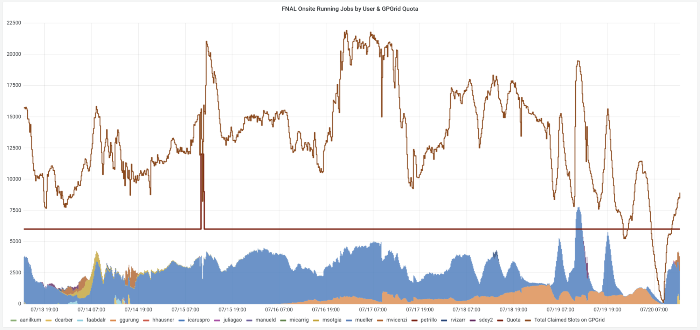
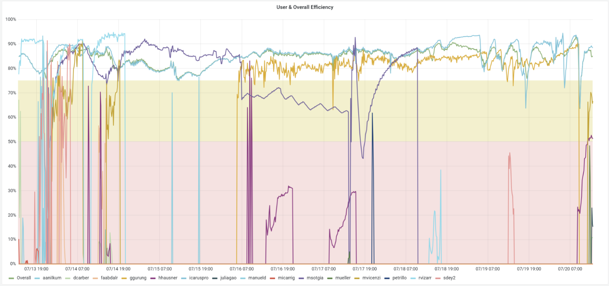
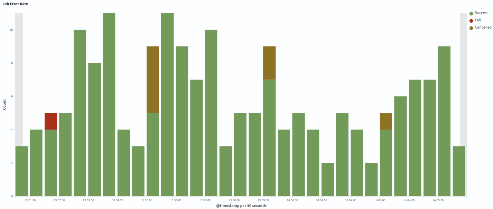
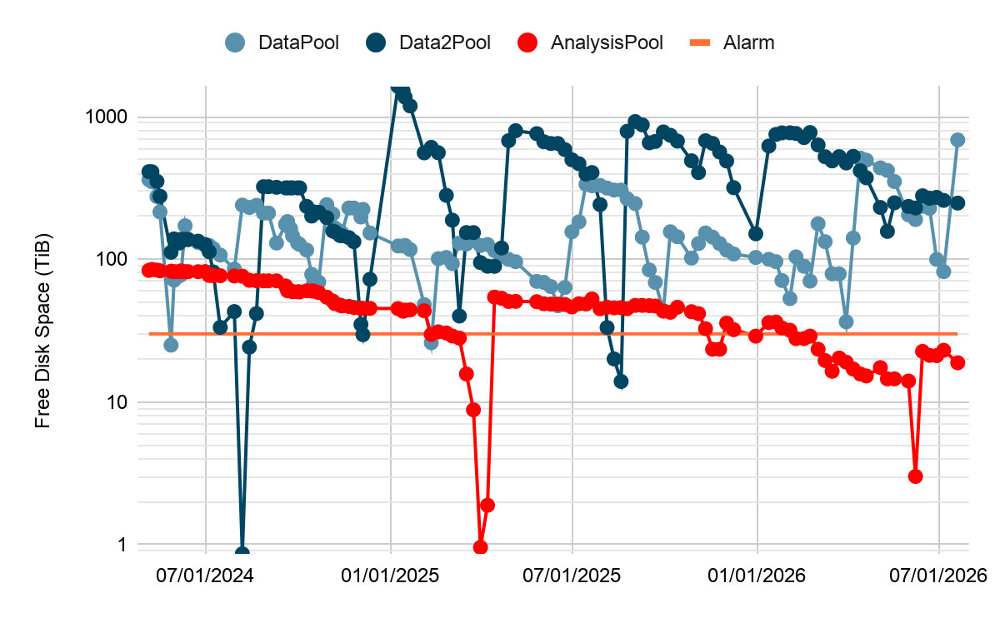
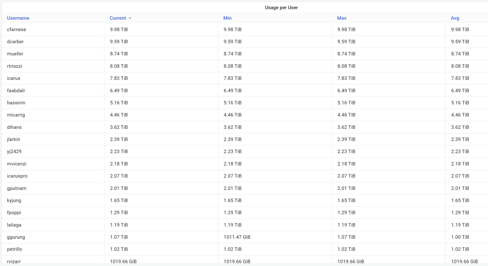
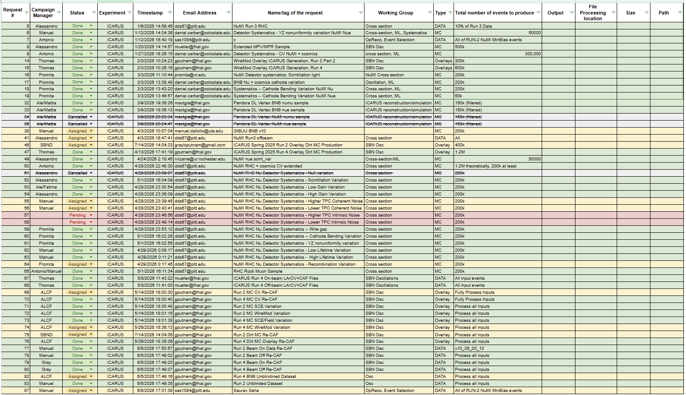

# ICARUS Data Production and Management Meeting

## lug 21, 2026 09:00 GMT-5

## Attendees

Alessandro Maria Ricci, Giuseppe Cerati, Gianmarco Cuciniello, Matthew Siden, Vito Di Benedetto, Saurav Saha, Fatima Abd Alrahman, Manuel Dallolio, Antonio Gioiosa

# Monitor

| User Grid UsageHistory of the Running Jobs by User for the last 7 days: [link](https://fifemon.fnal.gov/monitor/d/000000053/experiment-batch-details?orgId=1&viewPanel=9&from=now-7d&to=now&var-experiment=icarus&var-pool=dune-global&var-pool=fifebatch)  | User Job EfficiencyHistory of the User Job Efficiency for the last 7 days: [link](https://fifemon.fnal.gov/monitor/d/000000022/experiment-efficiency-details?from=now-7d&to=now&var-experiment=icarus&var-pool=dune-global&var-pool=fifebatch&orgId=1&viewPanel=2)  |
| ----- | ----- |
| **Icaruspro Jobs Exit Code**History of the icaruspro job exit code for the last 7 days: [link](https://landscape.fnal.gov/osprod/app/dashboards#/view/ba047b90-b8ca-11e7-989a-91951b87e80a?_g=\(filters:!\(\),refreshInterval:\(pause:!t,value:0\),time:\(from:now-15m,to:now\)\)&_a=\(description:'View%20jobs%20exit%20code,%20where%20they%20ran,%20and%20logs',filters:!\(\('$state':\(store:appState\),meta:\(alias:!n,disabled:!f,index:'fifebatch-history-*',key:pool,negate:!f,params:\(query:fifebatch\),type:phrase\),query:\(match:\(pool:\(query:fifebatch,type:phrase\)\)\)\),\('$state':\(store:appState\),meta:\(alias:!n,disabled:!f,index:'fifebatch-history-*',key:Owner,negate:!f,params:\(query:icaruspro\),type:phrase\),query:\(match_phrase:\(Owner:icaruspro\)\)\)\),fullScreenMode:!f,options:\(darkTheme:!f\),query:\(language:lucene,query:''\),timeRestore:!f,title:'Condor%20History',viewMode:view\)) | **SBN Data Pools**History of the SBN Data Pools: [link](https://fifemon.fnal.gov/monitor/d/rflbgV-iz/dcache-by-poolgroup?orgId=1&var-PoolGroup=SbnDataPools&from=now-3h&to=now&refresh=5m) |
|  |  |
| **Dcache Persistent Usage per User** Total is 114 TiB: [link](https://fifemon.fnal.gov/monitor/d/000000175/dcache-persistent-usage-by-vo?orgId=1&var-VO=icarus), Used space: 95.2 TiB (83.5%) |   |
|  |  |

### 

# Data Production

| 2026 ICARUS Requests [Link](https://docs.google.com/spreadsheets/d/1ffBp475tEzlRilFs7xLhbevSZHjsuk1Dm5FGFIPWsFM/edit?gid=588919686#gid=588919686) |
| ----- |
|  |

Link to [SBN spreadsheet](https://docs.google.com/spreadsheets/d/17mFPGsP7gw4GRLSCwIL15QrtUnLVri_2k2Wjzhd6Ork/edit?gid=1971194639#gid=1971194639)  
Link to [POMS active campaigns](https://pomsgpvm02.fnal.gov/poms/show_campaigns/icarus/production)

* Priority:  
  * Requests 69-78  
  * Requests 67-68, 79-80  
  * Increasing statistics of BNB Run2 Overlay B  
  * Requests 51-65  
* Link to [SBN-production-coordination](https://docs.google.com/document/d/1n-ohkPORnkhiyzEKMAlY4m1bTeovy9I1iOxQIN0lJmU/edit?tab=t.0)  
* Alessandro Create a campaign template with associated cfg.  
* Alessandro Training of Matthew Siden and Giovanni Chiello  
* Updated SAM configuration to run jobs with input files at NERSC \-\> TO BE TESTED

# Data Management

Link to [action items](https://github.com/orgs/SBNSoftware/projects/32)

## FTS

* Saurav **Transfer of Run2 compressed files to Tape** **(420 TB)**  
  The transfer to tape has been split by data stream, the selection was based on origin path (SBNDATA/SBNDATA2 suffix is to select files from one of SBNDataPools/SBNData2Pools):  
  * run2\_compressed\_bnbmajority\_SBNDATA \-\> DELETED   
  * run2\_compressed\_bnbmajority\_SBNDATA2 \-\> DELETED  
  * run2\_compressed\_bnbminbias\_SBNDATA \-\> DELETED  
  * run2\_compressed\_bnbminbias\_SBNDATA2 \-\> DELETED  
  * run2\_compressed\_offbeambnbmajority\_SBNDATA \-\> DELETED  
  * run2\_compressed\_offbeambnbmajority\_SBNDATA2 \-\> DELETED  
  * run2\_compressed\_offbeambnbminbias\_SBNDATA \-\> DELETED  
  * run2\_compressed\_offbeambnbminbias\_SBNDATA2 \-\> DELETED

  **Keep a subset of bnbmajority compressed raw data (run 9435).** 31 files do not have metadata and remain on disk. Run 2 raw data have some missing files, we need to regenerate them.

* Alessandro Transfer of BNB stage1 run2 to tape:  
  * Icaruspro\_2024\_Run2\_production\_Reproc\_Run2\_v09\_89\_01\_01p03\_bnbmajority\_stage1 (90 TB) \-\> COMPLETED  
  * Icaruspro\_2024\_Run2\_production\_Reproc\_Run2\_v09\_89\_01\_01p03\_offbeambnbmajority\_stage1 (70 TB) \-\> COMPLETED  
  * icaruspro\_production\_v09\_89\_01\_01\_2024A\_ICARUS\_MC\_Sys\_NuCos\_2024A\_MC\_Sys\_NuCos\_CV\_2ndV\_stage1 (51 TB) \-\> COMPLETED

  Some files remained on disk because they do not have metadata.

* Transfer of BNB Run 2 systematics sample to tape:  
  **`/pnfs/sbn/data/sbn_fd/poms_production/2024A_ICARUS_MC_Sys_NuCos`**  
  823G 2024A\_MC\_Sys\_NuCos\_10Per\_IntNoiseDown\_2ndV  
  840G 2024A\_MC\_Sys\_NuCos\_10Per\_IntNoiseUp\_2ndV  
  863G 2024A\_MC\_Sys\_NuCos\_CathBen\_2ndV  
  684G 2024A\_MC\_Sys\_NuCos\_CathBen\_2ndV\_correct  
  825G 2024A\_MC\_Sys\_NuCos\_CollPlaneGain5Per\_2ndV  
  1021G 2024A\_MC\_Sys\_NuCos\_CV  
  58T 2024A\_MC\_Sys\_NuCos\_CV\_2ndV  
  11T 2024A\_MC\_Sys\_NuCos\_CV\_5800  
  12T 2024A\_MC\_Sys\_NuCos\_CV\_6200  
  118G 2024A\_MC\_Sys\_NuCos\_CV\_part2  
  254G 2024A\_MC\_Sys\_NuCos\_CV\_part3  
  160G 2024A\_MC\_Sys\_NuCos\_CV\_part4  
  888G 2024A\_MC\_Sys\_NuCos\_GainHi\_2ndV  
  838G 2024A\_MC\_Sys\_NuCos\_GainVar\_2ndV  
  885G 2024A\_MC\_Sys\_NuCos\_HighLT\_2ndV  
  884G 2024A\_MC\_Sys\_NuCos\_HighLT\_2ndV\_correct  
  876G 2024A\_MC\_Sys\_NuCos\_HiTPCCohNoise\_2ndV  
  871G 2024A\_MC\_Sys\_NuCos\_HiTPCNoise\_2ndV  
  877G 2024A\_MC\_Sys\_NuCos\_IndGap1WireFil\_2ndV  
  863G 2024A\_MC\_Sys\_NuCos\_LoTPCNoise\_2ndV  
  878G 2024A\_MC\_Sys\_NuCos\_LowLT\_2ndV  
  878G 2024A\_MC\_Sys\_NuCos\_LowLT\_2ndV\_correct  
  874G 2024A\_MC\_Sys\_NuCos\_LowTPCCohNoise\_2ndV  
  874G 2024A\_MC\_Sys\_NuCos\_LowTPCCohNoise\_3rdV  
  944G 2024A\_MC\_Sys\_NuCos\_NewCV\_MidIndShptime\_2ndV  
  880G 2024A\_MC\_Sys\_NuCos\_NullVar\_2ndV  
  867G 2024A\_MC\_Sys\_NuCos\_RecoMod\_2ndV  
  932G 2024A\_MC\_Sys\_NuCos\_respunCV\_2ndV  
  805G 2024A\_MC\_Sys\_NuCos\_ScintQE\_2ndV  
  87G 2024A\_MC\_Sys\_NuCos\_SigStretch\_2ndV  
  1.2T 2024A\_MC\_Sys\_NuCos\_SigStretchDown\_2ndV  
  1.3T 2024A\_MC\_Sys\_NuCos\_SigStretchUp\_2ndV  
  53G 2024A\_MC\_Sys\_NuCos\_TPCSigShp  
  44T 2024A\_MC\_Sys\_NuCos\_TPCYZsim\_3rdV

## Storage

* Promita Update the available samples in SBN Production wiki.  
* SauravAlessandro Investigate:  
  * /data\_stage1 TO BE DELETED  
  * /icarus\_keepup  
    * ask for calibration ntuples of run3 because we have multiple copies  
  * /mc/2025A\_ICARUS\_NuGraph2 TO BE DELETED  
  * BNB Overlay campaign: check if we can remove some versions  
  * run3 specific runs with PMT wave forms?

* Alessandro Write Data Manager Guide  
* Fatima Migration of ICARUS SAM to SBN SAM database. Issues with some [datasets](https://docs.google.com/spreadsheets/d/1iEhvyPTk6b-OyqO4GY4xYq8V9HB-Ds2myRgbThkDFMo/edit?gid=0#gid=0). Run1 not transferred.

## CNAF

* **RUN3 Processing**:   
  **Valerio and his team:** they have processed 100% of on- and off-beam, both bnbmajority and bnbminbias. Now the Italian team is processing the Calibration. Then, stage1 and caf will be reprocessed. **CNAF is full at 99%. Calibration is ongoing.**

## COMPUTING

* Vito:  
  * Token in FTS tested but not used in production for the moment.  
  * Files must be transferred manually to NERSC. Rucio is setting up to transfer files with NERSC. Rucio also uses a proxy, need to use tokens.  
  * SDumont in Brazil (LNCC): setup ongoing, available from July (estimate).  
  * There is a long maintenance at NERSC on July 30th  
  * Submission in icarusgpvm06 is broken for SL7  
  * Kibana retired
